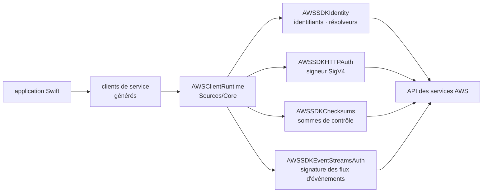

# awslabs/aws-sdk-swift

> **Le SDK officiel AWS pour Swift : appeler les services Amazon depuis du code Swift.**

## Le problème

Sans SDK dédié, parler aux services AWS depuis Swift oblige à réimplémenter à la main la
signature SigV4 des requêtes, la résolution des identifiants, les sommes de contrôle et le
format des flux d'événements — du code de plomberie cryptographique qu'on n'a aucune envie
d'écrire ni de maintenir soi-même, et qui échoue silencieusement quand il est faux.

## Ce que ça fait vraiment

Le dépôt publie le SDK AWS pour Swift, maintenu par AWS sous l'organisation `awslabs`. Le
README ne décrit pas les clients de service un par un : il renvoie à la page produit, au
guide développeur, à la référence d'API et à un dépôt d'exemples séparé
(`awsdocs/aws-doc-sdk-examples`, dossier `swift`).

La seule partie détaillée est la couche runtime, sous `Sources/Core/` :

- `AWSClientRuntime` — les types, protocoles et énumérations qui portent l'essentiel des
  fonctionnalités d'exécution spécifiques à AWS ; il dépend des autres modules runtime.
- `AWSSDKHTTPAuth` — le signeur SigV4 et les types liés au flux d'authentification.
- `AWSSDKIdentity` — les identifiants AWS et les résolveurs d'identité.
- `AWSSDKChecksums` — la gestion des sommes de contrôle dans les requêtes AWS.
- `AWSSDKEventStreamsAuth` — la signature des messages de flux d'événements AWS.
- `AWSSDKCommon` — les types concrets utilisés par les autres modules runtime.

Autrement dit : le README documente la mécanique de transport et d'authentification, pas la
surface applicative, qui vit dans la documentation en ligne.

## Comment c'est branché

Aucun diagramme tiré du code n'existe pour ce dépôt : ce schéma est reconstruit depuis le
seul README, à partir des modules runtime qu'il énumère sous `Sources/Core/`.



`AWSSDKCommon` fournit les types partagés entre ces modules. Le chemin d'une requête passe
donc par le client de service, la couche runtime commune, la résolution d'identité puis la
signature, avant de partir vers l'API du service.

## Essayer

```bash
# Aucune commande d'installation n'est documentée dans le README.
# Il renvoie à « Set up the AWS SDK for Swift » puis au tutoriel « Get started »
# du guide développeur en ligne, et au dépôt d'exemples awsdocs/aws-doc-sdk-examples.
```

Rien n'est reconstruit ici : la mise en place se lit dans le guide développeur, pas dans le
dépôt.

## Coût et pièges

La bibliothèque est sous licence Apache 2.0, donc gratuite. Ce qui coûte, c'est ce qu'il y a
au bout : il faut un compte AWS et des identifiants, et chaque appel de service est facturé
selon la tarification du service visé. Piège de lecture : le README ne documente ni les
versions de Swift supportées, ni les plateformes cibles, ni la procédure d'installation — il
faut sortir du dépôt pour savoir si l'on peut l'utiliser. Le dépôt d'exemples est ailleurs,
ce qui ajoute un aller-retour.

## Ce que ce n'est pas

Ce n'est pas une documentation autoportante : le README est une page d'aiguillage vers des
ressources externes, et n'apprend rien sur l'usage réel. Ce n'est pas non plus un framework
applicatif ni une couche d'abstraction au-dessus d'AWS — le SDK expose les API des services,
il ne simplifie pas leur modèle. Et ce n'est pas utilisable hors d'AWS : sans compte ni
identifiants, il ne sert à rien.

## Alternatives

Le README ne nomme aucun projet concurrent, et aucun voisin n'est fourni pour ce dépôt :
aucune alternative comparable dans le catalogue. Le seul autre dépôt cité est
`awsdocs/aws-doc-sdk-examples`, qui n'est pas une alternative mais le complément
d'exemples de code du même SDK.

## Pour toi

Intérêt faible pour un profil data / IA / MLOps, qui vit en Python : ce SDK n'a de sens que
si l'on écrit une application Swift — typiquement iOS ou macOS — qui doit parler à S3,
Bedrock ou tout autre service AWS. À garder en tête comme point d'entrée officiel si ce cas
se présente, pas à suivre autrement.
