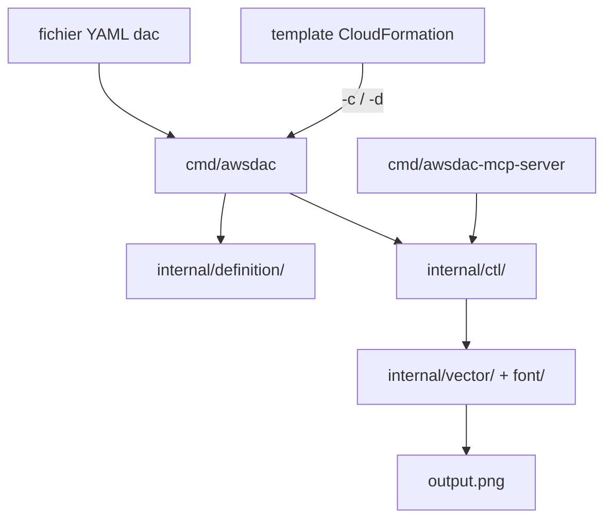

# awslabs/diagram-as-code

> CLI qui dessine des schémas d'architecture AWS depuis du YAML versionnable, sans navigateur ni GUI.

## Le problème
Les schémas d'architecture vivent dans des fichiers binaires qu'on ne peut ni relire en diff, ni regénérer en CI.
Ils dérivent de l'infrastructure réelle dès la première modification non reportée à la main.

## Ce que ça fait vraiment
Lit un fichier YAML décrivant ressources et liens, produit un PNG conforme aux conventions de schéma AWS.
Ajuste automatiquement position et taille des groupes ; gère le placement des liens, leur décalage et les ressources sur les bordures.
Convertit un template CloudFormation en schéma (`-c`) ou en fichier YAML dac (`-d`), les deux marqués bêta.
S'utilise aussi comme bibliothèque Go, et accepte des fichiers de définition pour dessiner du non-AWS.

## Comment c'est branché


## Essayer
```bash
go install github.com/awslabs/diagram-as-code/cmd/awsdac@latest
awsdac examples/alb-ec2.yaml
awsdac privatelink.yaml -o custom-output.png
```

## Coût et pièges
Aucune clé, aucun compte, aucun service tiers : l'outil est local et sans dépendance à un navigateur headless.
Go 1.21 minimum pour l'installation par `go install`, ou Homebrew sur macOS.

## Ce que ce n'est pas
Pas un éditeur graphique : il n'y a pas de manipulation interactive, seulement du YAML puis un rendu.
La conversion depuis CloudFormation est explicitement en bêta, donc pas le chemin à privilégier pour un existant complexe.
Pas un générateur depuis l'infrastructure déployée : il part du code, pas de l'état du compte.

## Alternatives
Aucune alternative nommée dans le README.

## Pour toi
Utile si ta doc d'archi AWS doit vivre dans Git et se regénérer en CI ; sans objet si tu ne dessines pas d'AWS.
