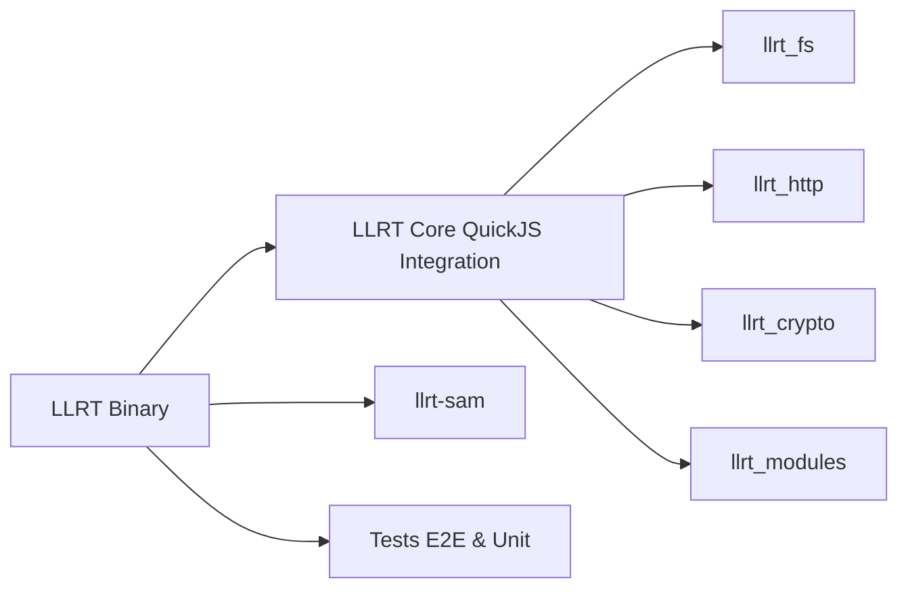

# awslabs/llrt

> Runtime JavaScript léger d'AWS, en Rust sur QuickJS, pour démarrer vite dans Lambda.

## Le problème
Node.js, Bun et Deno embarquent un compilateur JIT coûteux en démarrage et en mémoire, pénalisant pour des fonctions Lambda courtes.

## Ce que ça fait vraiment
Binaire sans JIT qui exécute du JavaScript ES2023, avec une partie des API Node, des API web et des clients AWS SDK v3 intégrés et optimisés (trois variantes : no-sdk, std-sdk, full-sdk). Déploiement comme runtime personnalisé, layer, image conteneur, SAM ou CDK. Test runner intégré compatible Jest/Chai. Annonce jusqu'à 10x plus rapide au démarrage.

## Comment c'est branché


## Essayer
```bash
llrt test
esbuild index.js --platform=browser --target=es2023 --format=esm --bundle --minify --external:@aws-sdk --external:@smithy
cargo build --release
```

## Coût et pièges
Gratuit ; code à bundler et TypeScript à transpiler avant déploiement. Plus lent que les runtimes JIT sur les calculs longs.

## Ce que ce n'est pas
Pas un remplaçant de Node.js (le README le répète) : `http`, `worker_threads`, `vm` manquent. Paquet explicitement expérimental, « pour évaluation ».

## Alternatives
- Node.js, Bun, Deno : runtimes généralistes à préférer pour tout traitement lourd ou toute appli hors fonctions Lambda courtes.

## Pour toi
À ignorer pour un profil data/IA : optimisation JavaScript très ciblée sur AWS Lambda, sans rapport avec l'entraînement ou le service de modèles.
