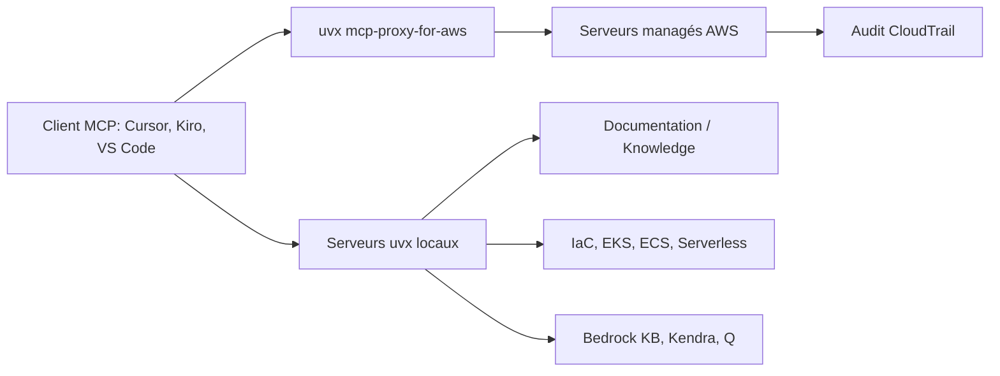

# awslabs/mcp

> Collection de serveurs MCP AWS : documentation, infrastructure, conteneurs, IA, recherche d'entreprise.

## Le problème
Un modèle ne connaît pas les sorties AWS récentes : il invente des API, cite des paramètres périmés
et produit de l'IaC qui ne passe pas la validation.

## Ce que ça fait vraiment
Publie une suite de serveurs MCP spécialisés, installables en un clic dans Cursor, VS Code ou Kiro.
Deux familles : des serveurs distants managés par AWS (AWS MCP Server en préversion, AWS Knowledge MCP
Server) et des serveurs locaux lancés par `uvx` (documentation, IaC, EKS, ECS, Finch, Serverless,
Lambda Tool, Transform, Bedrock Knowledge Bases, Kendra, Q Business, Q Index, import de modèles Bedrock).
L'AWS MCP Server ajoute validation syntaxique des appels, permissions IAM sans exposition de credentials
et journalisation CloudTrail complète.

## Comment c'est branché


## Essayer
```bash
uvx mcp-proxy-for-aws@latest https://aws-mcp.us-east-1.api.aws/mcp
uvx awslabs.aws-documentation-mcp-server@latest
uvx awslabs.aws-iac-mcp-server@latest
```

## Coût et pièges
Il faut un compte AWS, un profil (`AWS_PROFILE`) et une région ; les appels aux services sous-jacents
(Bedrock, Kendra, Q, EKS) se facturent. Certains serveurs exigent des flags explicites `--allow-write`
et `--allow-sensitive-data-access` : à manier avec prudence.

## Ce que ce n'est pas
Pas la voie recommandée à long terme : le README pousse désormais l'**Agent Toolkit for AWS** comme
successeur, et annonce que les projets les plus utiles y migreront. Le serveur Cloud Control API est
déjà **déprécié** au profit du serveur IaC. README tronqué : le catalogue complet n'est pas lisible ici.

## Alternatives
- **Agent Toolkit for AWS** : successeur annoncé, avec clés de condition IAM et visibilité CloudTrail.
- **AWS IaC MCP Server** : remplace le serveur Cloud Control API déprécié.

## Pour toi
Utile pour brancher un agent sur la doc AWS ; viser l'Agent Toolkit plutôt que d'investir ici.
