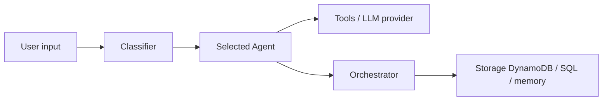

# awslabs/multi-agent-orchestrator

> Framework Agent Squad : aiguille chaque requête vers l'agent spécialisé adapté, en Python, TypeScript et Swift.

## Le problème
Avec plusieurs agents spécialisés, il faut choisir lequel répond et garder le contexte entre eux.

## Ce que ça fait vraiment
Un classifieur lit la description des agents et l'historique pour choisir l'agent ; l'orchestrateur enregistre l'échange. Agents prêts (Bedrock, Anthropic, OpenAI, Lex, Lambda), SupervisorAgent (équipe en parallèle) et GroundedAgent (un LLM collecte, un autre rédige). Runtime Swift sur appareil pour iOS et macOS. Le dépôt a changé de nom et d'organisation (2fastlabs/agent-squad).

## Comment c'est branché


## Essayer
```bash
npm install agent-squad
pip install "agent-squad[aws]"
```

## Coût et pièges
Modèles Bedrock, Anthropic ou OpenAI facturés par ton compte. Le classifieur ajoute un appel LLM par tour. L'adresse du README diffère du dépôt catalogué.

## Ce que ce n'est pas
Pas un dépôt AWS Labs actif : il a déménagé. Le diagramme fourni est sans composants lisibles.

## Alternatives
- Aucune alternative nommée dans le README.

## Pour toi
À surveiller : le routage entre agents et le GroundedAgent sont utiles, mais le déménagement du dépôt impose de vérifier la source active avant adoption.
