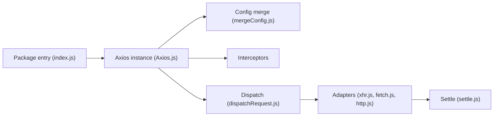

# axios/axios

> Client HTTP à promesses pour navigateur et Node.js, pour développeurs JavaScript.

## Le problème
`XMLHttpRequest` et les API HTTP natives sont verbeux ; on veut des promesses, des intercepteurs et un comportement identique côté navigateur et serveur.

## Ce que ça fait vraiment
On appelle `axios.get/post/…` ou `axios(config)`. La config est fusionnée (défauts, instance, requête), les intercepteurs de requête s'exécutent, puis un adaptateur (XHR, Fetch ou HTTP de Node) envoie la requête et renvoie une réponse au format commun. Extras : annulation (`AbortController`), sérialisation JSON, form-data et urlencoded, progression, limitation de débit, erreurs `AxiosError`, types TypeScript.

## Comment c'est branché


## Essayer
```bash
npm install axios
yarn add axios
pnpm add axios
```
Puis `const response = await axios.get('/user?ID=12345');` (exemple du README).

## Coût et pièges
Gratuit. Sécurité : `maxContentLength` et `maxBodyLength` valent -1 (illimité) par défaut, le README recommande un plafond face à des serveurs peu sûrs, et un `timeout` en production. Le README s'ouvre sur une longue liste de sponsors, dont des sites de paris.

## Ce que ce n'est pas
Pas un framework de requêtes avec cache ou nouvelle tentative intégrés. Les helpers `axios.all`, `axios.spread` et `CancelToken` sont dépréciés.

## Alternatives
Aucune alternative nommée dans le README.

## Pour toi
À ignorer : client HTTP JavaScript, hors du quotidien d'un profil data/IA qui appelle plutôt des API depuis Python.

