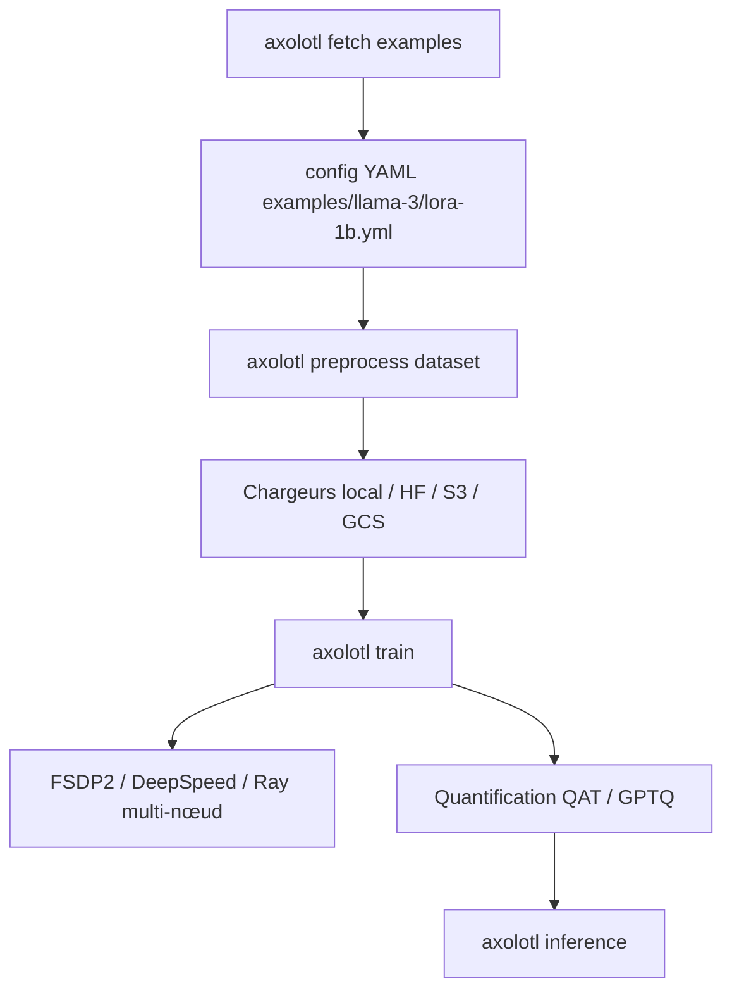

# axolotl-ai-cloud/axolotl

> Suite de post-entraînement de LLM pilotée par un seul YAML, pour praticiens du fine-tuning.

## Le problème
Chaque méthode de post-entraînement (LoRA, DPO, GRPO, QAT) arrive avec son script, ses formats de dataset et ses options d'optimisation.
Recoller tout ça à la main pour du multi-GPU ou du multi-nœud consomme plus de temps que l'entraînement lui-même.

## Ce que ça fait vraiment
Un fichier YAML couvre prétraitement du dataset, entraînement, évaluation, quantification et inférence.
Méthodes : fine-tuning complet, LoRA/QLoRA, GPTQ, QAT (int8/int4/FP8/NVFP4/MXFP4), DPO/IPO/KTO/ORPO, GRPO/GDPO, reward et process reward models.
Modèles texte, VLM (Qwen2-VL, Pixtral, LLaVA, InternVL, Gemma 3n…) et audio (Voxtral).
Optimisations : multipacking, Flash Attention 2/3/4, Liger Kernel, ScatterMoE, séquence parallèle, FSDP1/2, DeepSpeed, Torchrun, Ray.

## Comment c'est branché


## Essayer
```bash
curl -LsSf https://astral.sh/uv/install.sh | sh
uv venv --python 3.12
source .venv/bin/activate
uv pip install torch==2.12.1 torchvision
uv pip install --no-build-isolation axolotl[deepspeed]
axolotl fetch examples
axolotl train examples/llama-3/lora-1b.yml
docker run --gpus '"all"' --ipc=host --rm -it axolotlai/axolotl:main-latest
```

## Coût et pièges
Le logiciel est gratuit ; le GPU ne l'est pas — Ampere ou plus récent pour bf16 et Flash Attention, ou GPU AMD.
Télémétrie activée par défaut (système, type de modèle, taux d'erreur) : `AXOLOTL_DO_NOT_TRACK=1` pour la couper.

## Ce que ce n'est pas
Pas un service d'entraînement : vous fournissez la machine, ou vous louez chez RunPod, Modal, Vast.ai, Novita, JarvisLabs, Latitude.sh.
Pas un outil de pré-entraînement from scratch au premier chef, même si `agent-docs pretraining` couvre le pré-entraînement continu.
Pas d'inférence de production : la partie `inference` sert à vérifier un modèle, pas à servir du trafic.

## Alternatives
- Aucune alternative nommée dans le README ; les seuls dépôts cités sont des modèles et des fournisseurs de GPU.

## Pour toi
C'est la référence à connaître si tu fine-tunes des LLM ou des VLM : un YAML versionnable plutôt qu'un script jetable.
