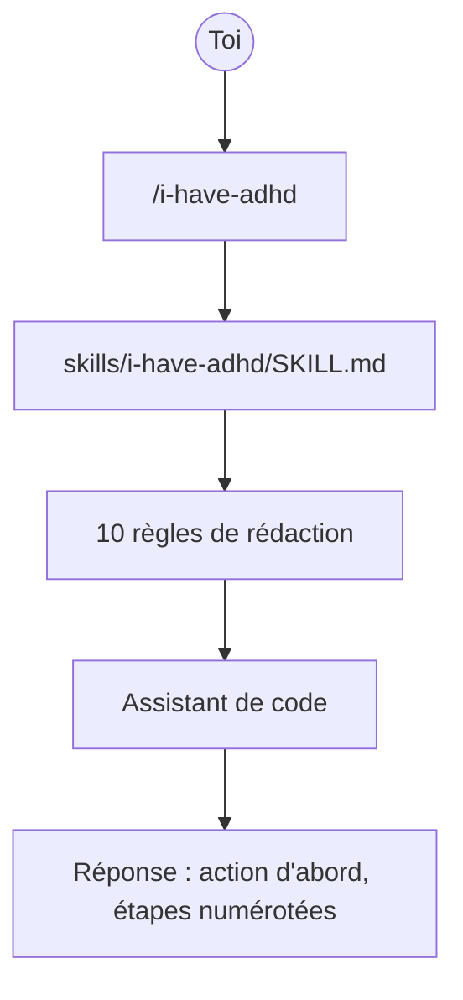

# ayghri/i-have-adhd

> Skill qui force un assistant de code à répondre par l'action, sans préambule ni digression.

## Le problème
Les réponses d'assistant noient la seule information utile — la commande à taper — sous
du contexte, des alternatives et des formules de politesse.

## Ce que ça fait vraiment
Installe un skill/plugin contenant dix règles de rédaction, détaillées dans `SKILL.md`.
Les règles : commencer par l'action suivante, numéroter les étapes, finir sur un pas concret,
supprimer les tangentes, rappeler l'état à chaque tour, donner des durées en minutes.
Aussi : rendre les progrès visibles, annoncer les erreurs platement, limiter les listes à cinq
éléments, et bannir préambule, récapitulatif et formule de clôture. Le README montre un avant/après.

## Comment c'est branché


## Essayer
```bash
claude plugin uninstall i-have-adhd            # drop the upstream copy first:
claude plugin marketplace remove i-have-adhd   # fork and upstream share both names
claude plugin marketplace add <your-username>/i-have-adhd
claude plugin install i-have-adhd@i-have-adhd
```

## Coût et pièges
Gratuit, rien à installer hors du plugin. Ces commandes sont celles du *fork* : pour la version
amont, le README fait coller un prompt d'installation en langage naturel dans l'assistant.

## Ce que ce n'est pas
Ce n'est pas un outil médical : le titre parle de TDAH mais le README précise qu'aucun diagnostic
n'est requis. Ce n'est pas un modèle ni un agent, seulement un jeu de consignes de style.
Adapté de *The Adult ADHD Tool Kit* pour la réponse d'un LLM, pas pour organiser ta journée.

## Alternatives
Aucune alternative nommée dans le README.

## Pour toi
À tester une semaine si tes échanges avec l'assistant te coûtent plus de lecture que de travail.
