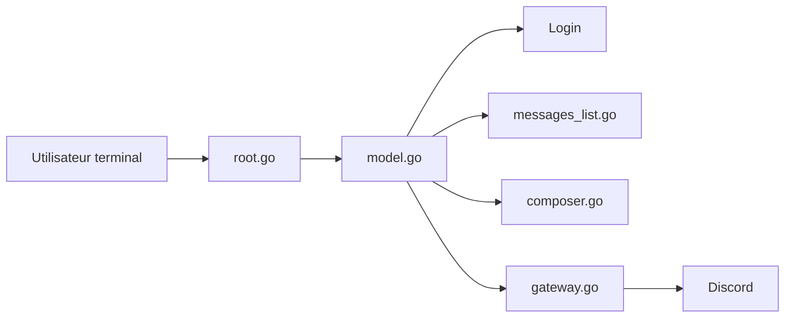

# ayn2op/discordo

> Client Discord en terminal, en Go, pour discuter depuis la ligne de commande.

## Le problème
Utiliser Discord impose le client graphique lourd ; certains veulent rester dans un terminal.

## Ce que ça fait vraiment
Interface texte : navigation par serveurs et canaux, liste de messages, composeur avec pièces jointes et mentions, rendu Markdown. Connexion par mot de passe, QR code ou jeton (variable `DISCORDO_TOKEN`). Le jeton est stocké dans le trousseau, la configuration dans un `config.toml`.

## Comment c'est branché


## Essayer
```bash
git clone https://github.com/ayn2op/discordo
cd discordo
go build .
./discordo
```

## Coût et pièges
Gratuit, compte Discord requis. Le README prévient : les comptes utilisateur automatisés (« self-bots ») violent les conditions d'utilisation de Discord, avec risque de perte de compte.

## Ce que ce n'est pas
Pas un bot ni une API Discord officielle : il se connecte avec ton compte personnel.

## Alternatives
Aucune alternative nommée dans le README.

## Pour toi
Ignorer : client de messagerie sans rapport avec ton métier, et le risque de bannissement du compte n'en vaut pas la peine.

