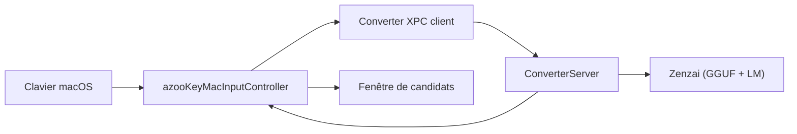

# azooKey/azooKey-Desktop

> Méthode de saisie japonaise pour macOS avec conversion kana-kanji neuronale (Zenzai).

## Le problème
Les IME japonais classiques convertissent imparfaitement ; ici un modèle neuronal améliore la précision.

## Ce que ça fait vraiment
Installé comme source de saisie macOS. Le contrôleur d'entrée relaie les touches par XPC vers un processus ConverterServer isolé qui garde l'état de conversion, puis affiche les candidats et insère le texte. Fonctions : historique, dictionnaire utilisateur, live conversion, AZIK, « conversion magique » par LLM (Apple Foundation Models ou OpenAI). Le README est en japonais.

## Comment c'est branché


## Essayer
```bash
brew install azooKey
brew upgrade azooKey
```
Puis déconnexion/reconnexion et ajout de la source de saisie.

## Coût et pièges
Le README annonce une version alpha « sans aucune garantie ». Compiler exige Xcode 26.1+, Git LFS et sous-modules. La conversion par LLM peut appeler OpenAI.

## Ce que ce n'est pas
Pas un projet d'IA générale : un IME japonais. Il ne sert pas hors saisie en japonais.

## Alternatives
Le README cite les ports fcitx5-hazkey (Linux), azooKey-Windows et azoo-key-skkserv.

## Pour toi
À ignorer, sauf si tu écris beaucoup en japonais : rien à en tirer pour un travail data/MLOps, et l'alpha est sans garantie.
