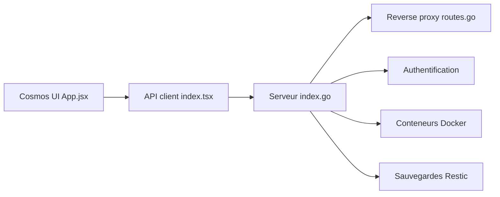

# azukaar/Cosmos-Server

> Serveur domestique auto-hébergé : reverse proxy, authentification, conteneurs, VPN et sauvegardes dans une seule interface web.

## Le problème
Les applications auto-hébergées (Plex, HomeAssistant, photos) réimplémentent chacune leur authentification et restent exposées sans protection commune.

## Ce que ça fait vraiment
Cosmos se place en passerelle devant vos conteneurs : reverse proxy avec HTTPS automatique, authentification multi-facteur et OpenID, SmartShield (limitation de débit, bannissements, anti-bot). Il ajoute app store, gestion de conteneurs et de disques, VPN (Constellation), sauvegardes via Restic, supervision et tâches CRON. Un SDK JS, un SDK Go et un provider Terraform existent.

## Comment c'est branché


## Essayer
```bash
sudo docker run -d --network host --privileged --name cosmos-server -h cosmos-server --restart=always -v /var/run/docker.sock:/var/run/docker.sock -v /var/run/dbus/system_bus_socket:/var/run/dbus/system_bus_socket -v /:/mnt/host -v /var/lib/cosmos:/config azukaar/cosmos-server:latest
```
Puis ouvrir `http://ip-du-serveur` et suivre l'assistant.

## Coût et pièges
Gratuit. La commande monte le socket Docker, et optionnellement tout le disque, en mode privilégié : c'est un accès très large. Ne pas passer par les templates Unraid, CasaOS ou Portainer. Licence non identifiée par GitHub : à lire avant tout usage commercial.

## Ce que ce n'est pas
Pas un gestionnaire de fichiers ni de machines virtuelles (le README le dit). Pas un complément à placer derrière un autre reverse proxy. Les comparatifs du README sont ceux de l'auteur.

## Alternatives
- Unraid : gère les VM, ce que Cosmos ne fait pas.
- YunoHost, CasaOS, Cloudron : alternatives citées au README, plus orientées app store.

## Pour toi
Surveiller : utile pour un homelab qui héberge des outils MLOps, mais l'accès privilégié au socket Docker et la licence floue demandent vérification.

