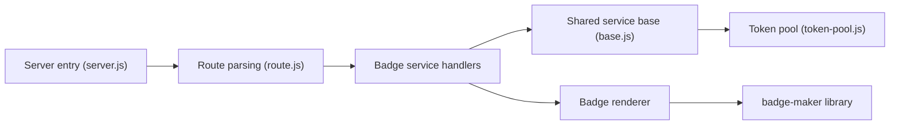

# badges/shields

> Service Shields.io de badges SVG, et bibliothèque npm badge-maker, pour README et pages web.

## Le problème
Afficher l'état d'un projet (version, CI, couverture, téléchargements) de façon uniforme demande un générateur qui interroge de nombreuses sources.

## Ce que ça fait vraiment
Serveur Node qui reçoit une URL de badge, choisit un service (GitHub, npm, GitLab, endpoints JSON dynamiques...), interroge l'API tierce puis rend un SVG ou un raster. Une file de tokens en base SQL protège les quotas d'API comme GitHub. La bibliothèque `badge-maker` génère des badges sans le serveur. Un site Docusaurus sert de catalogue. Métriques Prometheus ou Influx, Sentry en option.

## Comment c'est branché


## Essayer
```bash
npm ci
npm start
npm run badge -- /npm/v/nock
```
puis ouvrir `http://localhost:3000/` (Node 24 requis d'après le README).

## Coût et pièges
Le service public est gratuit. L'auto-hébergement demande des jetons pour les API en quota et une base ; le README renvoie à un guide d'auto-hébergement.

## Ce que ce n'est pas
Ce n'est pas un outil de qualité de code : il affiche des métriques calculées ailleurs. La présence d'un projet dans awesome-badges n'est pas un aval du projet.

## Alternatives
- Aucune alternative nommée dans le README (renvoi vers awesome-badges).

## Pour toi
Surveiller : utile pour badger tes dépôts avec un simple lien, inutile de l'héberger toi-même sauf besoin particulier.

