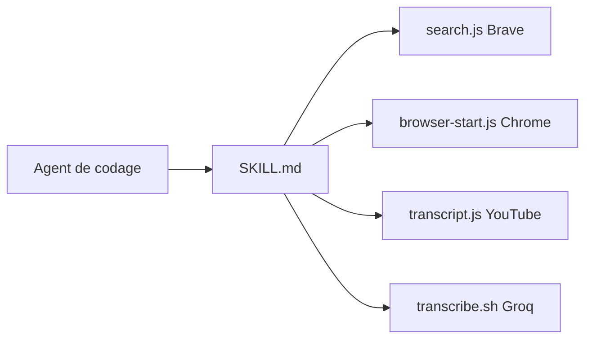

# badlogic/pi-skills

> Collection de skills (recherche web, navigateur, Google, transcription) pour agents de codage compatibles pi, Claude Code ou Codex.

## Le problème
Donner à un agent de codage la recherche web, le pilotage de navigateur ou l'accès à Gmail et Drive demande d'écrire des outils à la main pour chaque agent.

## Ce que ça fait vraiment
Huit skills sous forme de dossiers `SKILL.md` avec des scripts Node : `brave-search`, `browser-tools` (Chrome DevTools Protocol : démarrage, navigation, évaluation, sélection, cookies, capture), `gccli`, `gdcli`, `gmcli` (Calendar, Drive, Gmail), `transcribe` (Groq Whisper), `vscode`, `youtube-transcript`. On clone le dépôt dans le dossier de skills de l'agent.

## Comment c'est branché


## Essayer
```bash
git clone https://github.com/badlogic/pi-skills ~/pi-skills
mkdir -p ~/.claude/skills
ln -s ~/pi-skills/brave-search ~/.claude/skills/brave-search
ln -s ~/pi-skills/youtube-transcript ~/.claude/skills/youtube-transcript
```

## Coût et pièges
Clé Brave Search ou clé Groq selon le skill. Claude Code ne lit qu'un niveau de dossier : il faut des liens symboliques. `gccli`, `gdcli` et `gmcli` donnent accès à des données Google personnelles. La liste des prérequis mentionne un skill `subagent` absent du tableau.

## Ce que ce n'est pas
Pas un framework d'agent : ce sont des outils à brancher. Les implémentations Google, transcription et VS Code n'ont pas été examinées dans l'architecture fournie.

## Alternatives
Aucune alternative nommée dans le README.

## Pour toi
À surveiller : `browser-tools` et `youtube-transcript` sont des briques utiles pour une veille automatisée, à condition d'auditer ce que les skills Google peuvent lire.

