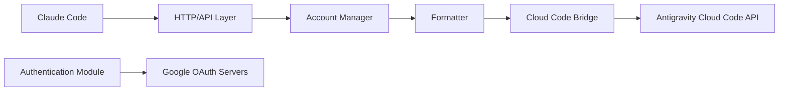

# badrisnarayanan/antigravity-claude-proxy

> Proxy local qui traduit l'API Anthropic vers Antigravity Cloud Code pour utiliser Claude et Gemini dans Claude Code.

## Le problème
Utiliser Claude Code sans facturation directe Anthropic suppose de faire passer ses requêtes par un autre fournisseur de modèles.

## Ce que ça fait vraiment
Le serveur Node reçoit des requêtes au format Anthropic Messages, utilise les jetons OAuth de comptes Google liés (ou la session locale d'Antigravity), les convertit au format Google Generative AI, les envoie à l'API Cloud Code d'Antigravity, puis reconvertit les réponses (streaming et raisonnement compris). Plusieurs comptes peuvent être répartis (round-robin, sticky, hybride). Une console web et une CLI (`acc`) gèrent comptes et configuration.

## Comment c'est branché


## Essayer
```bash
npx antigravity-claude-proxy@latest start
antigravity-claude-proxy accounts add
curl http://localhost:8080/health
```

## Coût et pièges
Gratuit selon le README (« Google Cloud »), mais Google a émis des bannissements pour violation des conditions d'utilisation sur des comptes connectés à ce proxy. Le README recommande un compte jetable. Le service dépend d'un point d'accès bac à sable de Google, non officiel.

## Ce que ce n'est pas
Ce n'est pas un outil approuvé par Google. Ce n'est pas un moyen stable d'accéder à Claude : le fournisseur peut couper l'accès, suspendre le compte ou changer l'API à tout moment. Il ne remplace ni un abonnement Anthropic, ni l'API officielle.

## Alternatives
- claude-code-proxy : proxy d'API Anthropic fondé sur LiteLLM, cité dans les crédits.
- opencode-antigravity-auth : greffon OAuth Antigravity pour OpenCode, dont le projet s'inspire.

## Pour toi
À ignorer : le risque de bannissement de compte Google, dont le README prévient lui-même, dépasse le gain ; utilise l'API officielle d'un fournisseur.
