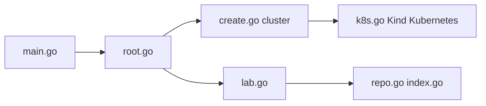

# badtuxx/girus-cli

> CLI pour lancer en local des laboratoires pratiques Linux, Docker, Kubernetes ou Terraform dans un cluster Kind.

## Le problème
S'exercer à Kubernetes ou Terraform exige une infrastructure ou un service cloud payant (type Katacoda, Instruqt).

## Ce que ça fait vraiment
`girus create cluster` vérifie Docker, installe Kind, crée un cluster local et déploie backend (Go) et frontend (React). Des laboratoires sont décrits en YAML (`lab.yaml`) et distribués via des dépôts à index (`index.yaml`, `girus repo`, `girus lab`). Le dépôt ne contient que le CLI ; backend et frontend sont décrits mais absents du code.

## Comment c'est branché


## Essayer
```bash
curl -sSL girus.linuxtips.io | bash
girus create cluster
girus repo add linuxtips https://github.com/linuxtips/labs/raw/main
girus lab list
girus lab install linuxtips linux-basics
```

## Coût et pièges
Gratuit. Docker obligatoire ; le README annonce environ 1 à 2 Go de RAM et 5 Go de disque. Le script d'installation par `curl | bash` est à examiner avant exécution.

## Ce que ce n'est pas
Pas une plateforme en ligne ni un outil de production : c'est de la formation locale. README en portugais avec versions espagnole et portugaise. Licence GPL-3.0. Version 0.5.0 annoncée en mai 2025.

## Alternatives
Katacoda et Instruqt sont cités comme services SaaS que Girus remplace par une exécution locale.

## Pour toi
À surveiller : utile pour monter en compétence Kubernetes ou Docker sur ta machine, peu pertinent pour le cœur de ton métier data/IA.

