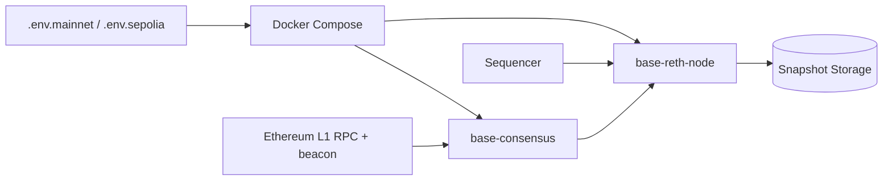

# base/node

> Conteneurs Docker, désormais archivés, pour faire tourner un nœud du L2 Ethereum Base.

## Le problème
Opérer son propre nœud Base (OP Stack) plutôt que dépendre d'un fournisseur RPC tiers.

## Ce que ça fait vraiment
Un `docker compose` lance `base-reth-node` (exécution) et `base-consensus`, configurés par `.env.mainnet` ou `.env.sepolia`. Le nœud se synchronise depuis un RPC Ethereum L1 et un endpoint beacon que tu fournis.
Options : mode Flashblocks (`RETH_FB_WEBSOCKET_URL`), mode suivi, élagage (`RETH_PRUNING_ARGS`) ; snapshots pour accélérer la synchronisation.
L'analyse d'architecture fournie décrit une version antérieure (clients geth, reth, nethermind, supervisord) qui ne correspond plus au README.

## Comment c'est branché


## Essayer
```bash
docker compose up --build
NETWORK_ENV=.env.sepolia docker compose up --build
```

## Coût et pièges
32 Go de RAM minimum (64 recommandés), SSD NVMe, stockage de deux fois la chaîne plus le snapshot ; un nœud L1 complet à fournir.

## Ce que ce n'est pas
Plus maintenu : dépôt archivé, développement déplacé vers `base/base`. Aucune garantie de sécurité ni de protection des actifs (clause « AS IS »). Rien à voir avec l'IA.

## Alternatives
- base/base — là où se poursuivent le développement et les versions.

## Pour toi
À ignorer : dépôt archivé et hors périmètre.
