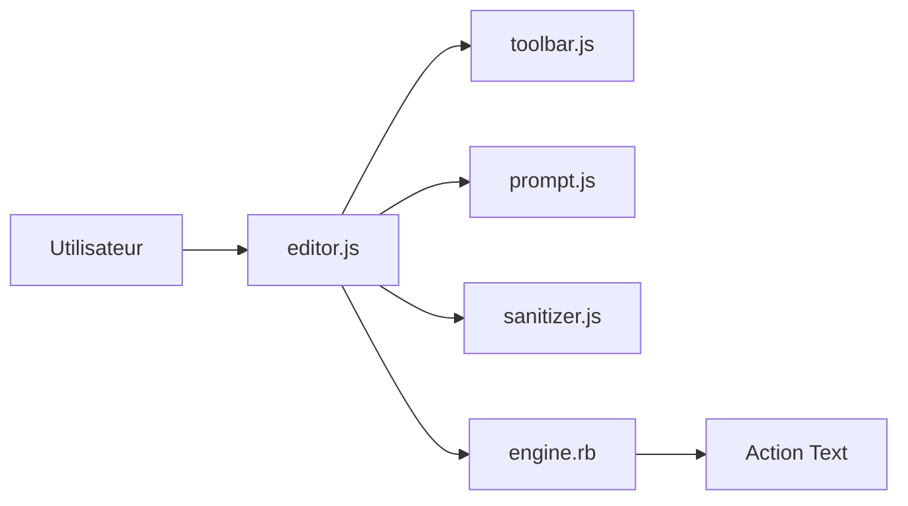

# basecamp/lexxy

> Éditeur de texte riche pour Rails, basé sur Lexical de Meta, compatible Action Text.

## Le problème
L'éditeur Trix d'Action Text est limité ; il faut un éditeur moderne qui produise le même HTML attendu par Rails.

## Ce que ça fait vraiment
README très court (moins de 800 caractères). Il annonce : base Lexical, bon HTML sémantique, raccourcis Markdown, coloration de code, prompts configurables (mentions), aperçu des pièces jointes. Le code montre un moteur Rails et un composant d'éditeur JS avec barre d'outils, tableaux et sanitizer.

## Comment c'est branché

## Essayer
Aucune commande documentée dans le README ; voir la documentation en ligne.

## Coût et pièges
Gratuit. Réservé aux applications Rails. 102 issues ouvertes.

## Ce que ce n'est pas
Pas un éditeur générique indépendant de Rails.

## Alternatives
Aucune alternative citée dans le README.

## Pour toi
À ignorer : brique front pour applications Rails, sans lien avec data ou IA ; matière trop mince pour juger plus.

