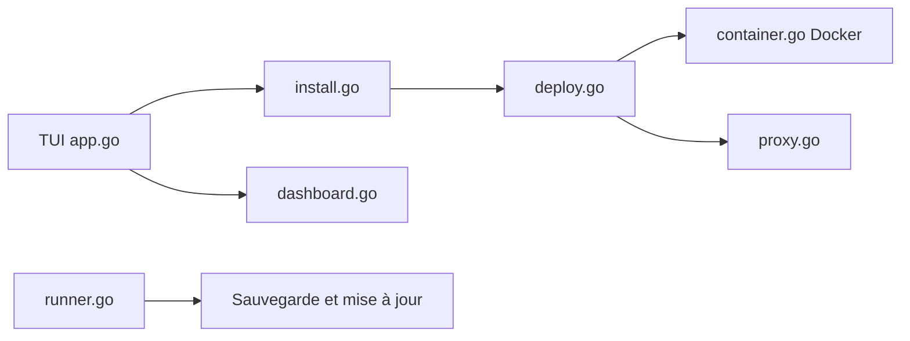

# basecamp/once

> Plateforme en terminal pour installer et gérer des applications web Docker auto-hébergées, avec sauvegardes et mises à jour.

## Le problème
Auto-héberger des applications demande de configurer à la main conteneurs, proxy HTTPS, sauvegardes et mises à jour.

## Ce que ça fait vraiment
Un binaire `once` (TUI et CLI) installe une image Docker, configure un nom d'hôte, démarre le conteneur derrière un proxy HTTP, puis propose un tableau de bord. Sauvegardes vers un emplacement choisi, mises à jour automatiques, service en arrière-plan, métriques. Fournit des applications de 37signals et accepte toute image compatible : HTTP sur le port 80, route `/up`, données dans `/storage`, scripts `pre-backup` et `post-restore` optionnels.

## Comment c'est branché


## Essayer
```bash
curl https://get.once.com | sh
curl https://get.once.com | ONCE_INTERACTIVE=false sh
sudo once background install
once --help
```

## Coût et pièges
Linux ou macOS, Docker (installé par le script si absent). Il faut un enregistrement DNS pointant vers la machine. Avec Cloudflare en proxy, mode SSL « Strict ». Le script `curl | sh` est à examiner avant exécution.

## Ce que ce n'est pas
Pas un orchestrateur multi-serveurs comme Kubernetes. Une partie des applications intégrées sont des produits de 37signals, sans lien avec l'IA. Les statistiques d'usage collectées ne sont pas décrites dans le README.

## Alternatives
Aucune alternative nommée dans le README.

## Pour toi
À surveiller : pratique pour héberger sur un petit serveur des outils internes (tableaux de bord, wikis) emballés en conteneur, sans pertinence directe pour l'IA.

