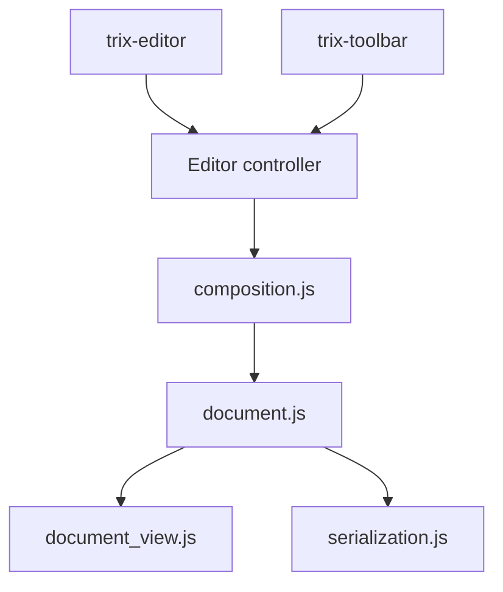

# basecamp/trix

> Éditeur de texte riche WYSIWYG pour applications web, issu de 37signals, pour développeurs front-end.

## Le problème
Les éditeurs basés sur `contenteditable` et `execCommand` se comportent différemment selon les navigateurs. Produire un HTML propre et cohérent devient pénible.

## Ce que ça fait vraiment
Trix traite `contenteditable` comme un simple périphérique d'entrée : chaque frappe devient une opération sur un modèle de document interne immuable, puis est re-rendue. Il gère les pièces jointes (glisser-déposer, upload à faire soi-même), l'annulation illimitée, la sanitisation via DOMPurify et l'intégration aux formulaires via Element Internals.

## Comment c'est branché


## Essayer
```bash
yarn install
yarn build
yarn start
yarn test
```
```html
<input id="x" type="hidden" name="content">
<trix-editor input="x"></trix-editor>
```

## Coût et pièges
Gratuit. Ne jamais mettre de HTML non fiable directement dans la balise `<trix-editor>` (avertissement du README). L'upload des fichiers reste à ta charge.

## Ce que ce n'est pas
Ce n'est pas un éditeur collaboratif ni un éditeur Markdown : il vise des messages, commentaires et listes simples.

## Alternatives
Le README n'en nomme aucune.

## Pour toi
À ignorer pour un travail data/IA/MLOps : c'est une brique front-end de saisie de texte, utile seulement si tu construis une interface web (notamment Rails).

