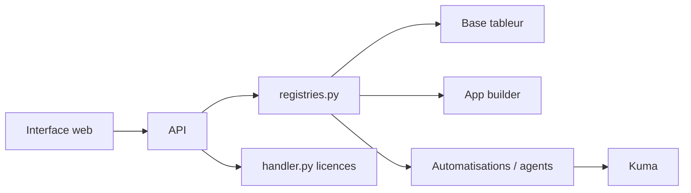

# baserow/baserow

> Plateforme no-code open source de bases de données, apps, automatisations et agents IA, alternative à Airtable.

## Le problème
Les équipes non techniques veulent structurer des données et bâtir des outils internes sans développeur ni abonnement Airtable.

## Ce que ça fait vraiment
Un tableur-base de données (Django, Vue.js, PostgreSQL) avec API REST, constructeur d'applications publiables sur un domaine propre, tableaux de bord, automatisations, agents IA et un assistant nommé Kuma. Déploiement par Docker, Helm, Docker Compose ou plateformes (Heroku, Render, AWS…). Le cœur est sous MIT, les fonctions premium et entreprise ont une licence séparée.

## Comment c'est branché


## Essayer
```bash
docker run -v baserow_data:/baserow/data -p 80:80 -p 443:443 baserow/baserow:2.3.4
```

## Coût et pièges
L'auto-hébergement est gratuit ; les fonctions premium/entreprise sont payantes. L'assistant IA et les agents supposent un fournisseur de modèle (non détaillé dans le README). Le catalogue n'identifie pas la licence alors que le README annonce MIT : à vérifier.

## Ce que ce n'est pas
Pas un outil de data science : c'est une base no-code. Le label « conforme SOC 2 / HIPAA » concerne l'offre cloud annoncée par l'éditeur.

## Alternatives
- Airtable : le produit visé, cité dans le README.

## Pour toi
À surveiller : pratique pour exposer des données à des métiers ou annoter des jeux de données, sans remplacer un entrepôt de données.

