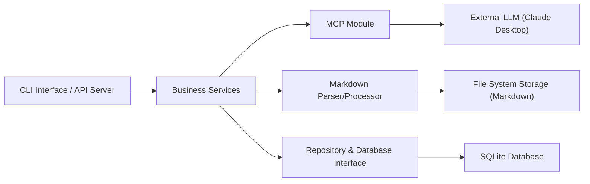

# basicmachines-co/basic-memory

> Serveur MCP qui donne aux assistants IA une mémoire persistante, écrite en notes Markdown locales.

## Le problème
Les conversations avec un LLM sont éphémères : ce qui a été décidé ou appris disparaît d'une session à l'autre.

## Ce que ça fait vraiment
Le serveur MCP écrit et lit des notes Markdown sur ton disque (dans `~/basic-memory` par défaut). Chaque note contient des observations et des relations en wikilinks, qui forment un graphe de connaissances. Un index SQLite (ou Postgres) permet la recherche texte et sémantique, avec reranking optionnel. Il fonctionne avec Claude Desktop, Claude Code, Codex, Cursor, VS Code et ChatGPT, et les notes restent lisibles dans Obsidian. Une offre cloud payante ajoute synchronisation et sauvegardes.

## Comment c'est branché


## Essayer
```bash
uv tool install basic-memory --prerelease=allow
claude mcp add basic-memory -- uvx --prerelease=allow basic-memory mcp
basic-memory project add research ~/research
export BASIC_MEMORY_NO_PROMOS=1
```

## Coût et pièges
Le local est gratuit. Le drapeau `--prerelease=allow` est obligatoire : la version 0.23 dépend d'une préversion de FastMCP 4. Le cloud coûte 15 $/mois (essai de 7 jours). La télémétrie est anonyme (promotions et connexions cloud vers Umami) ; `BASIC_MEMORY_NO_PROMOS=1` la désactive.

## Ce que ce n'est pas
Ce n'est pas une base vectorielle ni un RAG sur documents : les notes sont écrites par l'agent ou par toi. La licence AGPL-3.0 est copyleft : elle pèse surtout si tu héberges le code modifié comme service.

## Alternatives
Aucune alternative nommée dans le README (il ne cite que des catégories : historique de chat, RAG, bases vectorielles).

## Pour toi
À adopter en local si tu utilises Claude Code ou Cursor au quotidien : les notes restent des fichiers à toi, et le cloud est optionnel ; désactive la télémétrie et vérifie l'AGPL avant tout usage en service.
