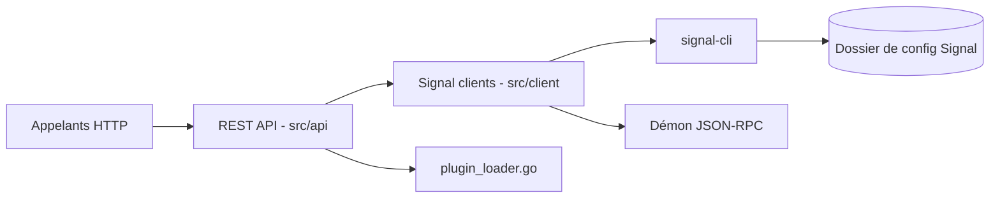

# bbernhard/signal-cli-rest-api

> API REST dockerisée autour de signal-cli pour envoyer et recevoir des messages Signal par script.

## Le problème
Signal n'a pas d'API officielle simple pour automatiser l'envoi de messages ou de notifications.

## Ce que ça fait vraiment
Un service Go expose en HTTP l'inscription d'un numéro, l'envoi (pièces jointes, groupes), la réception, le lien d'appareils, les groupes, les pièces jointes et le profil. Il délègue à `signal-cli` selon quatre modes : `normal`, `native` (binaire GraalVM), `json-rpc` (démon JVM) et `json-rpc-native`. L'état du compte (clés) se stocke dans un dossier monté. Un mécanisme de plugins ajoute des endpoints.

## Comment c'est branché


## Essayer
```bash
mkdir -p $HOME/.local/share/signal-api
sudo docker run -d --name signal-api --restart=always -p 8080:8080 \
      -v $HOME/.local/share/signal-api:/home/.local/share/signal-cli \
      -e 'MODE=native' bbernhard/signal-cli-rest-api
curl -X POST -H "Content-Type: application/json" 'http://localhost:8080/v2/send' \
     -d '{"message": "Test via Signal API!", "number": "+4412345", "recipients": [ "+44987654" ]}'
```

## Coût et pièges
Gratuit, mais il faut un numéro Signal (à enregistrer ou lier via QR code). Le dossier monté contient les clés : à protéger. `AUTO_RECEIVE_SCHEDULE` peut faire perdre des messages si tu reçois par l'API.

## Ce que ce n'est pas
Ce n'est pas un service officiel Signal. Le mode `native` est signalé comme potentiellement moins stable. Aucune authentification de l'API n'est documentée.

## Alternatives
Aucune alternative nommée dans le README ; `signal-cli` est la brique sous-jacente.

## Pour toi
À surveiller : pratique pour des alertes de pipeline vers Signal, à isoler car l'API n'a pas d'authentification documentée.

