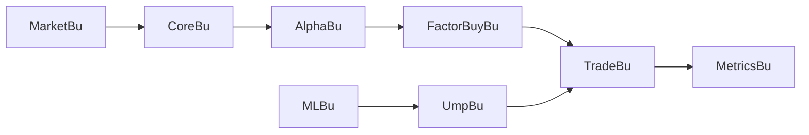

# bbfamily/abu

> Système Python de trading quantitatif et backtesting, documenté en chinois, avec service web associé.

## Le problème
Développer, backtester et optimiser des stratégies de timing et de sélection d'actifs demande beaucoup de code répétitif pour données, frais, slippage et métriques.

## Ce que ça fait vraiment
Le package `abupy` fournit facteurs d'achat et de vente, stops, slippage et commissions, gestion de position, sélection de titres.
Métriques de backtest, recherche d'hyperparamètres par grid search, scoring.
Marchés : actions US, A, Hong Kong, futures, options, bitcoin et litecoin ; module ML et système de « juges » (UmpBu) pour filtrer les trades.
Tutoriels en notebooks ; une grande partie du README promeut le site abuquant.com.

## Comment c'est branché

## Essayer
Aucune commande shell : le README recommande Anaconda et propose seulement de tester `import abupy` en Python.

## Coût et pièges
Code gratuit sous GPL-3.0 ; les rapports IA en temps réel sont sur un site commercial. Documentation et liens essentiellement en chinois.

## Ce que ce n'est pas
Pas une garantie de performance : les « 18 496 stratégies » et promesses de battre le marché ne sont pas étayées par le README. Pas un outil de trading réel branché à un broker documenté.

## Alternatives
Aucune alternative nommée ; le README renvoie à un dépôt compagnon abu_ml.

## Pour toi
À ignorer : README surtout promotionnel, affirmations non vérifiables et GPL ; pour du backtest, des bibliothèques mieux documentées existent dans ton écosystème.
