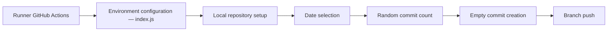

# bcanseco/github-contribution-graph-action

> Action GitHub qui crée des commits vides pour remplir artificiellement votre graphe de contributions.

## Le problème
Le graphe de contributions GitHub ne reflète pas l'activité menée ailleurs (GitLab, Bitbucket, GitHub Enterprise).

## Ce que ça fait vraiment
L'action lit ses variables d'environnement, prépare un clone, choisit les dates éligibles, tire un nombre aléatoire de commits par jour et pousse des commits vides. Elle peut remplir jusqu'à un an en arrière, en excluant week-ends ou jours de semaine. Le README cite aussi l'intérêt de faire bonne figure auprès des recruteurs.

## Comment c'est branché


## Essayer
```yml
on:
  schedule:
  - cron: '0 12 * * *'
jobs:
  single-commit:
    runs-on: ubuntu-latest
    permissions:
      contents: write
    steps:
    - uses: bcanseco/github-contribution-graph-action@v2
      env:
        GITHUB_TOKEN: ${{ secrets.GITHUB_TOKEN }}
        GIT_EMAIL: you@youremail.com
```

## Coût et pièges
Gratuit. `FORCE_PUSH=true` vide le dépôt à chaque exécution. Nécessite un e-mail associé au compte pour que les commits comptent.

## Ce que ce n'est pas
Ne produit aucun vrai travail : il fabrique de l'activité factice, ce qui peut tromper un recruteur. Aucune valeur pour un projet data/IA.

## Alternatives
Aucune alternative nommée dans le README.

## Pour toi
À ignorer : il ne sert qu'à embellir un graphe de contributions, ce qui ne t'apporte rien en technique et peut nuire à ta crédibilité.

