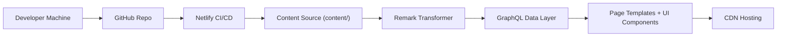

# bchiang7/v4

> Code du site personnel de Brittany Chiang, en Gatsby et Netlify, forkable à condition de la citer.

## Le problème
Le dépôt ne résout pas un problème d'outillage : c'est un portfolio publié en open source. Il sert de référence de design, pas de brique réutilisable.

## Ce que ça fait vraiment
Un site statique Gatsby. Le Markdown de `content/` (featured, jobs, posts, projects) est lu par `gatsby-source-filesystem`, transformé par `gatsby-transformer-remark`, exposé en GraphQL, puis rendu par des templates et composants React. Netlify construit à chaque push et sert le résultat sur CDN.

## Comment c'est branché


## Essayer
```bash
npm install -g gatsby-cli
nvm install
yarn
npm start
npm run build
npm run serve
```

## Coût et pièges
Gratuit. L'auteur n'a pas conçu le site comme un thème de départ : pas de support d'implémentation, il renvoie à la doc Gatsby. Le fork exige une attribution avec lien vers brittanychiang.com.

## Ce que ce n'est pas
Pas un starter ni un template générique : le contenu et le design sont ceux de l'auteur. Dernier push en juillet 2024, avec 48 issues ouvertes. Aucun rapport avec la data ou l'IA.

## Alternatives
Aucune alternative nommée dans le README (seules des « itérations précédentes » du même site sont citées).

## Pour toi
À ignorer : c'est un portfolio front-end sans lien avec la data, l'IA ou le MLOps, et il n'a plus bougé depuis juillet 2024.

