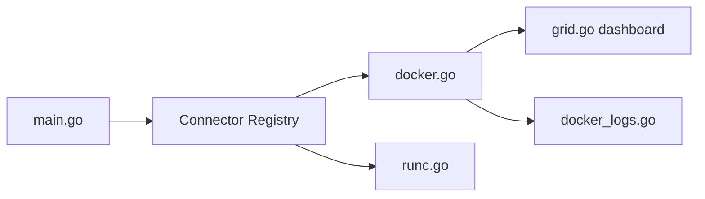

# bcicen/ctop

> Interface de type top en terminal pour suivre les métriques de conteneurs Docker et runC.

## Le problème
`docker stats` est peu lisible dès qu'on suit plusieurs conteneurs.

## Ce que ça fait vraiment
Affiche en temps réel les métriques de plusieurs conteneurs avec tri, filtre, vue détaillée, logs, exec de shell et configuration de colonnes. Connecteurs Docker et runC. Une config se sauvegarde avec `S`.

## Comment c'est branché


## Essayer
```bash
docker run --rm -ti \
  --name=ctop \
  --volume /var/run/docker.sock:/var/run/docker.sock:ro \
  quay.io/vektorlab/ctop:latest
```

## Coût et pièges
Gratuit. Accès au socket Docker. Le paquet Debian est tenu par un tiers. Dernier push en juillet 2024.

## Ce que ce n'est pas
Ce n'est pas un outil de supervision persistante : pas d'historique ni d'alertes. Les autres connecteurs restent « planifiés ».

## Alternatives
- Awesome Docker list : le README y renvoie pour des outils similaires.

## Pour toi
Surveiller : pratique pour inspecter un hôte Docker à la main, mais peu actif depuis 2024 et à un seul mainteneur.

