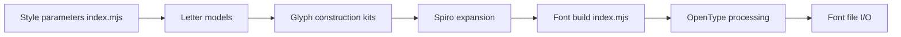

# be5invis/Iosevka

> Famille de polices à chasse fixe, personnalisable, conçue pour le code et les terminaux.

## Le problème
Les polices de code standard sont larges ou peu configurables ; difficile d'afficher beaucoup de colonnes sans sacrifier la lisibilité.

## Ce que ça fait vraiment
Fournit 6 sous-familles à chasse fixe (sans empattement ou slab, 3 espacements) et 2 quasi-proportionnelles (Aile, Etoile), en 9 graisses, 2 largeurs, 3 inclinaisons. Plus de 240 langues latines/grecques/cyrilliques partielles. Variantes de caractères, jeux stylistiques et ligatures activables via OpenType ; une compilation depuis les sources permet de choisir ses ligatures.

## Comment c'est branché


## Essayer
```bash
curl -s 'https://api.github.com/repos/be5invis/Iosevka/releases/latest' | jq -r ".assets[] | .browser_download_url" | grep PkgTTC-Iosevka | xargs -n 1 curl -L -O --fail --silent --show-error
brew install --cask font-iosevka
```

## Coût et pièges
Gratuit (licence OFL-1.1). Le dépôt ne maintient aucune distribution par gestionnaire de paquets : les paquets tiers peuvent être en retard. Certains logiciels abandonnent des fonctions OpenType si la liste est trop longue.

## Ce que ce n'est pas
Pas de couverture CJK : le README renvoie vers Sarasa Gothic. Ce n'est pas un outil de dev, juste une police.

## Alternatives
Sarasa Gothic : pour les caractères chinois, japonais, coréens.

## Pour toi
Pur confort d'éditeur/terminal : installe-la si tu aimes le code dense, sans enjeu pour un pipeline data ni MLOps.

