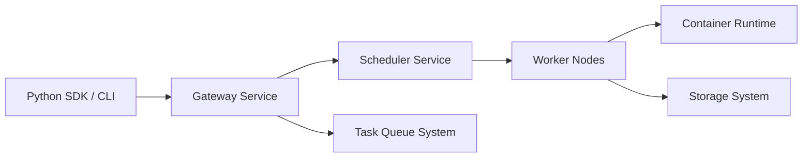

# beam-cloud/beta9

> Runtime open source pour déployer des charges IA serverless en Python, avec GPU et scale-to-zero.

## Le problème
Déployer un modèle ou des tâches de fond avec autoscaling et GPU demande de monter soi-même l'infrastructure.

## Ce que ça fait vraiment
Un SDK Python (décorateurs `endpoint`, `task_queue`, `Sandbox`) envoie le code à une passerelle ; un scheduler place les conteneurs sur des workers via un runtime maison. Fonctions annoncées : démarrages en moins d'une seconde, volumes distribués, webhooks, jobs planifiés. Beta9 est le moteur open source de Beam, le cloud géré ; auto-hébergement possible.

## Comment c'est branché


## Essayer
```bash
pip install beam-client
```
```python
from beam import Image, Sandbox
sandbox = Sandbox(image=Image()).create()
response = sandbox.process.run_code("print('I am running remotely')")
print(response.result)
```

## Coût et pièges
Cloud Beam : compte à créer, GPU facturés à l'usage (grille non fournie). Auto-hébergement : le README ne détaille pas l'installation. Licence AGPL-3.0.

## Ce que ce n'est pas
Pas un simple paquet pip : le client s'adresse à un backend (cloud ou le tien). L'AGPL impose des obligations si tu proposes le service à des tiers.

## Alternatives
- Celery : que `task_queue` prétend remplacer pour les tâches de fond.

## Pour toi
À surveiller : utile pour déployer des endpoints d'inférence sans gérer Kubernetes, mais l'auto-hébergement est non documenté ici et l'AGPL pèse pour un usage commercial.
