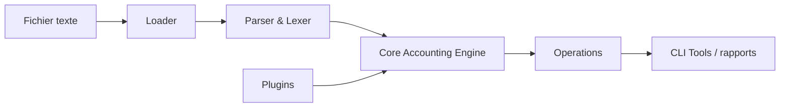

# beancount/beancount

> Langage de comptabilité en partie double à partir de fichiers texte, avec rapports, pour particuliers techniques.

## Le problème
Les logiciels comptables opaques enferment les données ; un journal texte reste lisible et versionnable.

## Ce que ça fait vraiment
On écrit les transactions dans un fichier texte ; le chargeur les analyse (lexer/parseur avec parties en C), applique les règles de partie double et les plugins de validation, puis les opérations produisent balances et rapports. La version 3 (stable depuis juin 2024) est allégée : la plupart des outils sont dans des projets séparés. La documentation est externe.

## Comment c'est branché

## Essayer
Aucune commande documentée : le README renvoie à la page d'installation de la documentation.

## Coût et pièges
Gratuit, GPL-2.0 uniquement. Installer la version 3 (branche v3) ; les versions 1 et 2 sont à éviter. Les outils de la v2 (dont l'interface web) ont migré ailleurs.

## Ce que ce n'est pas
Pas un logiciel graphique ni un connecteur bancaire.

## Alternatives
- Ledger : liste de discussion voisine citée pour la comptabilité en ligne de commande.

## Pour toi
À surveiller : format texte facile à analyser en Python/pandas pour des finances personnelles ; projet porté par une personne.

