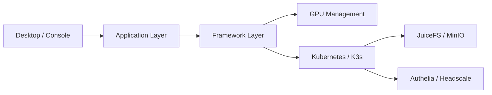

# beclab/Olares

> Système d'exploitation de cloud personnel sur Kubernetes, pour faire tourner agents et LLM sur son propre matériel.

## Le problème
Héberger IA, fichiers et applications chez soi sans confier ses données à un cloud tiers.

## Ce que ça fait vraiment
Installe une plateforme Kubernetes avec marché d'applications en un clic, gestion de GPU (time-slicing, memory-slicing, mode exclusif), stockage et sauvegardes, VPN privé, reverse proxy et applications système (Files, Vault, Market, Dashboard). Accès via un Olares ID et l'app LarePass. Une CLI, `olares-cli`, embarque des compétences pour agents.

## Comment c'est branché


## Essayer
```bash
curl -fsSL https://olares.sh | bash -
```

## Coût et pièges
Minimum 4 cœurs, 8 Go de RAM disponibles, 150 Go de SSD (échec sur HDD), Ubuntu 22.04–25.04 ou Debian 12/13. Compte Olares ID à créer. Licence AGPL-3.0. Installeur en `curl | bash`.

## Ce que ce n'est pas
Pas un simple NAS : c'est une plateforme complète, plus lourde. Ce n'est pas un outil de développement ML.

## Alternatives
Le README ne nomme aucune alternative, seulement une comparaison avec les NAS.

## Pour toi
À surveiller : intéressant pour un labo IA personnel avec GPU, mais il faut accepter une machine dédiée et une pile Kubernetes complète.
