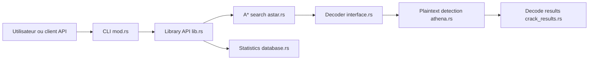

# bee-san/Ciphey

> Outil en Rust qui devine automatiquement comment décoder un texte encodé ou chiffré, pour CTF et analyse.

## Le problème
Face à un texte encodé (Base64, ROT13, Vigenère…), on ignore quelle chaîne de décodages appliquer. Essayer à la main coûte du temps.

## Ce que ça fait vraiment
Le README présente une réécriture en Rust de l'ancien Ciphey. Il teste des décodeurs (16 annoncés) et enchaîne plusieurs niveaux. La recherche utilise A* avec un cache et des statistiques de décodeurs. Un contrôle de texte clair (n-grammes, dictionnaire, ~500 regex, option BERT de 500 Mo) juge les résultats. Un timer coupe à 5 s en CLI.

## Comment c'est branché


## Essayer
```bash
cargo install ciphey
ciphey
git clone https://github.com/bee-san/Ciphey
docker build .
ciphey --enable-enhanced-detection
```

## Coût et pièges
Gratuit, licence MIT. La détection BERT demande un téléchargement unique de 500 Mo et un compte Hugging Face gratuit. Les chiffres de vitesse (×7, +700 %) sont ceux du README, non vérifiés ici.

## Ce que ce n'est pas
Pas un outil de cryptanalyse général : il couvre des encodages et chiffrements classiques. Le README parle de 16 décodeurs contre ~50 pour l'ancien Ciphey. L'interface TUI est décrite comme entièrement « vibe codée ».

## Alternatives
- Ciphey (version Python d'origine) : plus de décodeurs (~50), selon le README.
- PyWhat : identifie le type de donnée ; LemmeKnow en est la version Rust.

## Pour toi
À surveiller : utile pour se dépanner sur un CTF ou un texte encodé, mais marginal pour un profil data / IA / MLOps, et le projet repose sur une seule personne.

