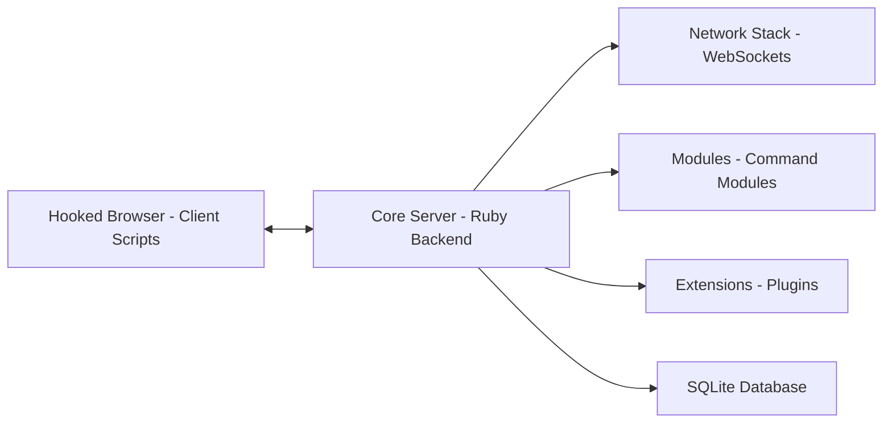

# beefproject/beef

> Framework d'audit de sécurité qui évalue l'exposition des navigateurs web, destiné aux pentesteurs mandatés.

## Le problème
Les audits se concentrent sur le périmètre réseau et le poste ; le navigateur, seule porte ouverte côté client, est peu testé.

## Ce que ça fait vraiment
Un serveur Ruby sert un script client (beef.js) à un navigateur « accroché », qui garde un canal de retour vers le serveur (REST, WebSocket). Le serveur envoie des modules de commande classés par catégorie (navigateur, hôte, réseau…). Les données collectées sont stockées en SQLite. Des extensions ajoutent une interface d'administration, du DNS, un proxy, une intégration Metasploit.

## Comment c'est branché


## Essayer
```bash
./install
./beef
```
Le README renvoie au wiki pour la configuration et la sécurisation avant tout usage.

## Coût et pièges
Gratuit. Ruby 3.0+, SQLite 3, Node.js 10+ ; macOS ou Linux, Windows non pris en charge. Selenium requis sur macOS.

## Ce que ce n'est pas
Un outil à double usage : à employer uniquement sur des systèmes dont on a l'autorisation écrite d'audit. Le catalogue ne relève aucune licence déclarée (le README évoque un fichier doc/COPYING) : réutilisation à clarifier avant intégration.

## Alternatives
Aucune alternative nommée dans le README.

## Pour toi
À surveiller : utile seulement si tu fais des audits web autorisés ; sans lien avec un travail data/IA/MLOps courant, et licence à éclaircir.

