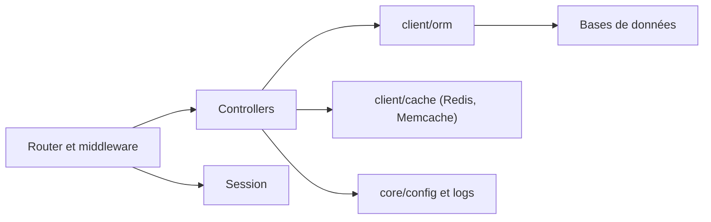

# beego/beego

> Framework Go full-stack pour API REST, applications web et services, inspiré de Tornado, Sinatra et Flask.

## Le problème
Assembler en Go un routeur, un ORM, des sessions, du cache et de la configuration oblige à choisir et brancher plusieurs bibliothèques.

## Ce que ça fait vraiment
Propose une architecture MVC avec routeur annotable, namespaces, documentation d'API automatique et outils de développement. Des modules couvrent orm, session, logs, config, cache (Redis, Memcache, SSDB, mémoire), httplib, task, i18n et admin. D'après l'architecture décrite : couches server/web, core et client.

## Comment c'est branché


## Essayer
```bash
mkdir hello
cd hello
go mod init
go get github.com/beego/beego/v2@latest
go mod tidy
go build hello.go
./hello
```
Le fichier hello.go contient un simple web.Run().

## Coût et pièges
Gratuit. Le README signale que le site de documentation est indisponible (sauvegarde fournie) et que son certificat HTTPS expire parfois. Licence non identifiée par GitHub.

## Ce que ce n'est pas
Ce n'est pas un outil data ni un framework léger : il embarque beaucoup de modules. La documentation officielle est difficile d'accès.

## Alternatives
Aucune alternative citée dans le README.

## Pour toi
À surveiller : utile seulement pour un back-end Go complet, avec une licence à clarifier et une doc fragile avant tout usage sérieux.

