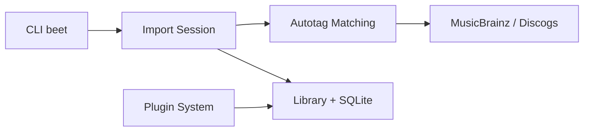

# beetbox/beets

> Gestionnaire de bibliothèque musicale qui corrige les métadonnées, pour collectionneurs méticuleux.

## Le problème
Une collection de fichiers musicaux a des étiquettes fausses, incomplètes ou en double.

## Ce que ça fait vraiment
`beet import` catalogue les fichiers, propose des corrections automatiques (MusicBrainz, Discogs, Beatport, empreintes acoustiques) puis stocke tags et fiches dans une base SQLite. Des plugins ajoutent pochettes, paroles, genres, ReplayGain, transcodage, détection de doublons, interface web et lecture MPD.

## Comment c'est branché


## Essayer
```bash
pip install beets
beet import ~/music/ladytron
```

## Coût et pièges
Gratuit. Les sources de métadonnées sont des services externes. 706 issues ouvertes : beaucoup.

## Ce que ce n'est pas
Ce n'est pas un lecteur ni un service de streaming. Les plugins se font en Python.

## Alternatives
Aucune alternative nommée dans le README.

## Pour toi
À ignorer : outil pour collection musicale, sans rapport avec un travail de data/IA, malgré sa qualité.

