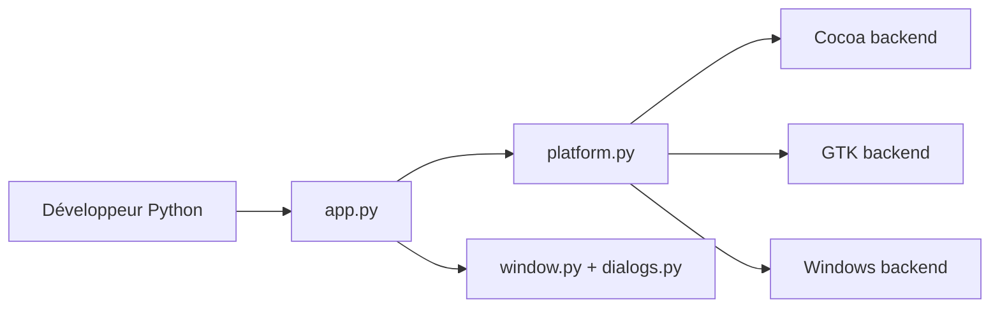

# beeware/toga

> Boîte à outils Python pour écrire des interfaces graphiques natives sur chaque système.

## Le problème
Écrire une application de bureau ou mobile en Python avec des widgets natifs oblige à apprendre une API par plateforme.

## Ce que ça fait vraiment
Une API Python commune (application, fenêtres, widgets, commandes et menus, boîtes de dialogue, documents, écrans, matériel, sources de données liste/arbre) qui choisit un backend natif selon la plateforme : Cocoa, GTK, Qt, Windows, Android, iOS, Web, Textual. Le README ne détaille presque rien d'autre ; la documentation est sur Read The Docs.

## Comment c'est branché


## Essayer
```bash
pip install toga-demo
toga-demo
```

## Coût et pièges
Gratuit. Chaque backend a ses prérequis propres, renvoyés à la documentation de plateforme (non lue ici). 311 issues ouvertes.

## Ce que ce n'est pas
Pas un framework web ni un outil de tableau de bord data : il vise des applications natives. Le README est très succinct.

## Alternatives
Aucune alternative nommée dans le README.

## Pour toi
Surveiller : une option pour livrer un petit outil interne en application native Python ; pour des tableaux de bord, un outil web reste plus adapté.

