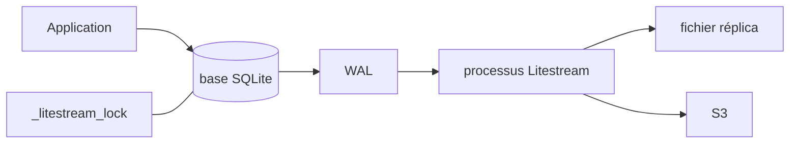

# benbjohnson/litestream

> Réplication continue d'une base SQLite vers un fichier ou S3, pour la reprise après sinistre.

## Le problème
Une base SQLite en production n'a pas de mécanisme de sauvegarde incrémentale intégré.
Copier le fichier à chaud risque de capturer un état incohérent pendant un checkpoint WAL.

## Ce que ça fait vraiment
Litestream tourne en processus d'arrière-plan et réplique les changements de façon incrémentale
vers un autre fichier ou vers S3. Il ne parle à SQLite que par l'API SQLite, donc il ne corrompt
pas la base. Il crée une table interne `_litestream_lock` dans la base source pour acquérir le
verrou d'écriture pendant la synchronisation autour des checkpoints WAL ; les écritures se font
dans des transactions annulées, donc aucune ligne n'y reste.

## Comment c'est branché

## Essayer
Aucune commande d'installation ou d'usage n'est documentée dans le README : il renvoie au site
web de Litestream pour les instructions d'installation et la documentation.

## Coût et pièges
Gratuit. La création de `_litestream_lock` modifie le schéma de la base source et peut changer son
nombre de pages : la base ne reste pas identique octet pour octet à son état d'avant Litestream.
Une destination S3 implique un compte et une facture de stockage à ta charge.

## Ce que ce n'est pas
Ce n'est pas un système de réplication multi-maître ni un cluster SQLite : c'est de la reprise
après sinistre. Ne pas supprimer `_litestream_lock` pendant que Litestream tourne — la synchro
autour d'un checkpoint peut échouer jusqu'à réinitialisation. La table se retrouve aussi dans les
bases restaurées, puisque le schéma source est sauvegardé.

## Alternatives
Aucune alternative n'est nommée dans le README.

## Pour toi
Utile si tu héberges une appli ou un service d'inférence adossé à SQLite et que tu veux une
sauvegarde continue sans monter un Postgres.
