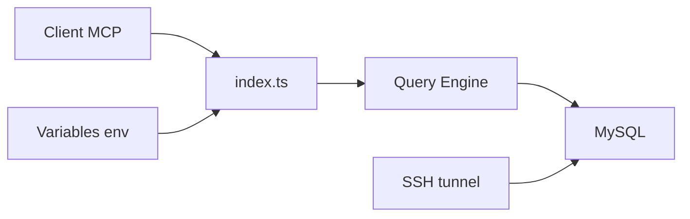

# benborla/mcp-server-mysql

> Serveur MCP donnant à un assistant IA un accès en lecture seule à une base MySQL.

## Le problème
Laisser un assistant interroger une base MySQL sans risque d'écriture ni fuite de données sensibles.

## Ce que ça fait vraiment
Un outil `mysql_query` exécute du SQL, en lecture seule par défaut ; INSERT, UPDATE et DELETE se débloquent par variables d'environnement. Une ressource `mysql://tables` liste tables et colonnes. S'y ajoutent mode multi-bases, permissions par schéma, masquage de PII, tunnel SSH, SSL/TLS et mode distant HTTP avec jeton.

## Comment c'est branché


## Essayer
```bash
claude mcp add mcp_server_mysql \
  -e MYSQL_HOST="127.0.0.1" \
  -e MYSQL_PORT="3306" \
  -e MYSQL_USER="root" \
  -e MYSQL_PASS="your_password" \
  -e MYSQL_DB="your_database" \
  -- npx @benborla29/mcp-server-mysql
```

## Coût et pièges
Node 20+ et MySQL 5.7+. Utiliser un utilisateur MySQL aux privilèges limités : l'exemple du README emploie `root`. Activer les écritures augmente le risque.

## Ce que ce n'est pas
Pas un client SQL complet ni une garantie de sécurité : la protection repose sur les flags et les droits du compte.

## Alternatives
- Aucune alternative nommée dans le README.

## Pour toi
Adopter si tu interroges du MySQL depuis Claude : lecture seule par défaut et PII masquable ; crée un compte dédié.
