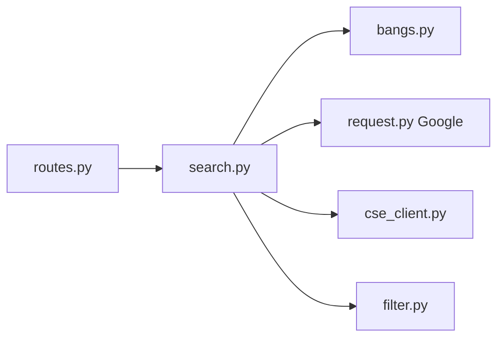

# benbusby/whoogle-search

> Proxy de recherche Google sans pubs ni traçage, arrêté en juillet 2026 car Google a bloqué son principe.

## Le problème
Obtenir des résultats Google sans publicités, JavaScript ni pistage de son adresse IP.

## Ce que ça fait vraiment
Historiquement : une application Flask qui interrogeait Google sans JavaScript, nettoyait les résultats, gérait bangs, thèmes, proxys et Tor. Le README du 24 juillet 2026 déclare que Whoogle ne renvoie plus de résultats : Google a bloqué les dernières chaînes User-Agent, et la voie Custom Search (BYOK) n'est plus viable.

## Comment c'est branché


## Essayer
```bash
docker pull benbusby/whoogle-search
docker run --publish 5000:5000 --detach --name whoogle-search benbusby/whoogle-search:latest
```
Ces commandes ne produiront plus de résultats, selon le README.

## Coût et pièges
Gratuit, mais inutilisable : plus de commits, correctifs ni support. Dépôt archivé.

## Ce que ce n'est pas
Ce n'est pas une solution fonctionnelle aujourd'hui : le README demande de ne pas s'attendre à ce qu'elle marche.

## Alternatives
- Searx : le README l'encourageait pour d'autres moteurs.
- Kagi : payant, cité comme solution de remplacement par des utilisateurs.

## Pour toi
Ignorer : archivé et cassé par le blocage de Google, ne l'installe pas.

