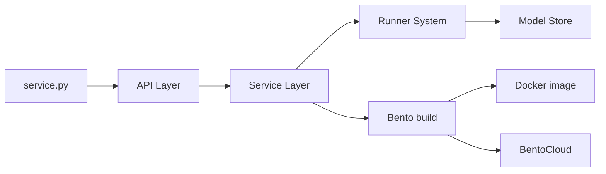

# bentoml/BentoML

> Bibliothèque Python pour transformer un script d'inférence en API servie et conteneurisée.

## Le problème
Passer d'un script de modèle à un service HTTP robuste demande de gérer dépendances, batching, GPU, versions et image Docker.

## Ce que ça fait vraiment
Tu déclares une classe `@bentoml.service` (image Python, paquets) et des méthodes `@bentoml.api` typées, éventuellement `batchable`. `bentoml serve` lance le serveur local, `bentoml build` crée un « Bento » (code, modèles, dépendances), `bentoml containerize` produit l'image Docker. Fonctions avancées : composition multi-modèles, batching adaptatif, workers, Model Store, observabilité. Déploiement optionnel sur BentoCloud.

## Comment c'est branché

(Diagramme fourni sans composant lisible : nœuds tirés de l'explication.)

## Essayer
```bash
pip install -U bentoml
bentoml serve
bentoml build
bentoml containerize summarization:latest
docker run --rm -p 3000:3000 summarization:latest
```

## Coût et pièges
Bibliothèque gratuite ; BentoCloud est payant. Collecte anonyme d'usage activée par défaut, désactivable avec `--do-not-track` ou `BENTOML_DO_NOT_TRACK=True`.

## Ce que ce n'est pas
Pas une plateforme MLOps complète (pas de suivi d'expériences) et pas un moteur d'inférence LLM optimisé : il enveloppe ton propre code.

## Alternatives
Aucune alternative nommée dans le README.

## Pour toi
À adopter pour servir des modèles en Python : API typée, batching et conteneurisation en trois commandes, projet d'entreprise installé de longue date ; pense seulement à couper la télémétrie.
