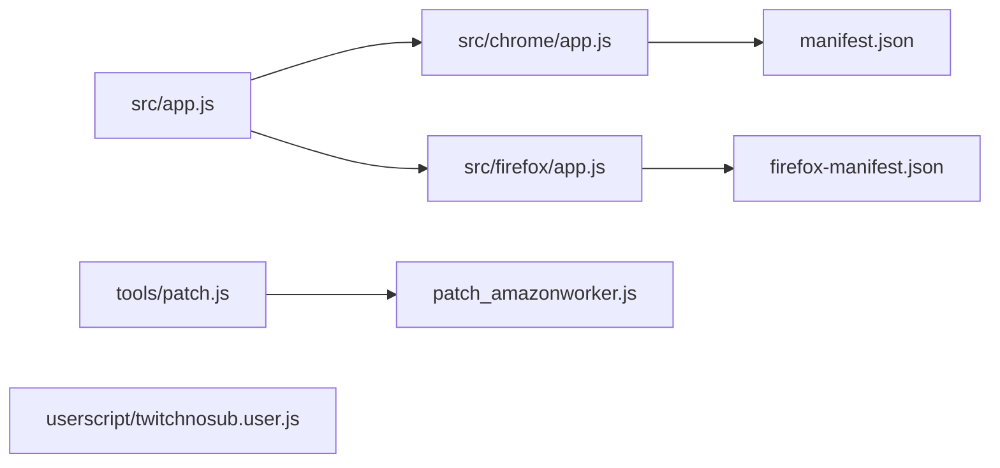

# besuper/TwitchNoSub

> Extension de navigateur pour regarder sur Twitch les rediffusions réservées aux abonnés.

## Le problème
Certaines rediffusions Twitch sont réservées aux abonnés ; l'extension vise à les rendre visibles sans abonnement.

## Ce que ça fait vraiment
D'après le code décrit, une logique commune (`src/app.js`) est adaptée par navigateur : Chrome (`manifest.json`) et Firefox (`firefox-manifest.json`), plus un userscript alternatif. Un correctif du worker vidéo (`patch_amazonworker.js`) et un outil `tools/patch.js` interviennent. Le README ne détaille pas le mécanisme.

## Comment c'est branché


## Essayer
```bash
chromium --pack-extension=TwitchNoSub
```
Pour Chrome : mode développeur puis « Load unpacked extension ». Pour Firefox : glisser le fichier `.xpi` de la section releases.

## Coût et pièges
Gratuit. Installation manuelle en mode développeur. Le README signale un projet en cours de travail. Dépend du site Twitch : tout changement côté Twitch peut le casser.

## Ce que ce n'est pas
Ce n'est pas un outil data ni un produit stable. Il contourne une restriction d'accès du service, ce qui peut enfreindre ses conditions d'utilisation.

## Alternatives
Aucune alternative nommée dans le README.

## Pour toi
À ignorer : sans rapport avec la data ou l'IA, et il contourne une restriction de service.

