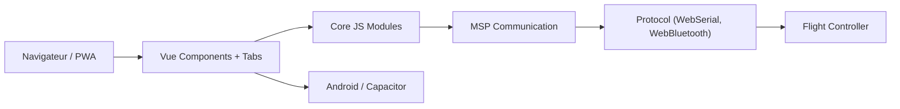

# betaflight/betaflight-configurator

> Application de configuration du firmware de contrôleurs de vol Betaflight, pour pilotes de drones.

## Le problème
Régler un contrôleur de vol (moteurs, failsafe, OSD) demande un outil dédié qui parle son protocole.

## Ce que ça fait vraiment
Application web progressive (PWA) construite avec Vue et Vite, qui dialogue avec le contrôleur en MSP via Web Serial ou Bluetooth. Elle existe aussi en installeurs Windows, Linux, macOS et Android (Capacitor). Elle gère plusieurs langues.

## Comment c'est branché


## Essayer
```bash
npm install
npm run dev
npm run build
npm run preview
npm test
```
Utiliser la version de Node indiquée dans `.nvmrc` (npm 11.6.1 ou plus).

## Coût et pièges
Gratuit. La version PWA de test peut corrompre les réglages du contrôleur. Sous Linux, ajouter l'utilisateur au groupe `dialout`.

## Ce que ce n'est pas
Pas le firmware : celui-ci vit dans le dépôt `betaflight/betaflight`. Pas un simulateur de vol.

## Alternatives
Aucune alternative nommée dans le README.

## Pour toi
À ignorer : réservé au réglage de drones, sans lien avec tes chaînes data/IA.

