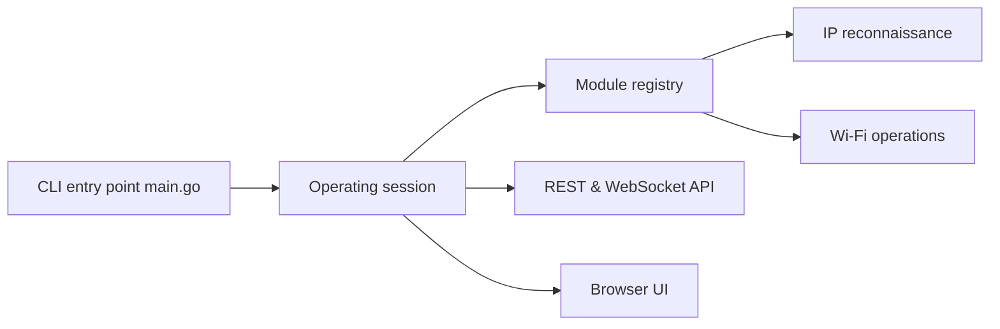

# bettercap/bettercap

> Framework Go d'analyse et d'audit de réseaux Ethernet, Wi-Fi, BLE, CAN et périphériques sans fil, pour chercheurs en sécurité autorisés.

## Le problème
Auditer un réseau et ses appareils demande de combiner de nombreux outils spécialisés, chacun avec son interface.

## Ce que ça fait vraiment
Un exécutable Go organisé en session et en modules. Les modules couvrent la découverte de machines, l'analyse du trafic, les réseaux Wi-Fi, les appareils Bluetooth Low Energy, le bus CAN et les périphériques sans fil. D'autres modules interviennent sur le trafic. Extensible en JavaScript, avec une API REST, une interface web et des « caplets » de scripts.

## Comment c'est branché

## Essayer
Aucune commande n'est documentée dans le README fourni ; il renvoie à la documentation du projet.

## Coût et pièges
Gratuit. Il exige des privilèges système (capture de paquets, routage, pare-feu) et parfois du matériel radio dédié. Les Dockerfile fournis facilitent le déploiement.

## Ce que ce n'est pas
Ce n'est pas un outil pour un réseau qui n'est pas le tien : les fonctions d'interception et de perturbation sont illégales sans autorisation explicite du propriétaire du réseau ou des appareils. La licence est présente mais non identifiée par GitHub.

## Alternatives
Le README ne nomme pas d'alternative.

## Pour toi
À surveiller : réservé à l'audit d'un banc d'essai ou d'un réseau que tu administres ; hors de ce cadre, il n'a pas d'usage pour un profil data/MLOps.
