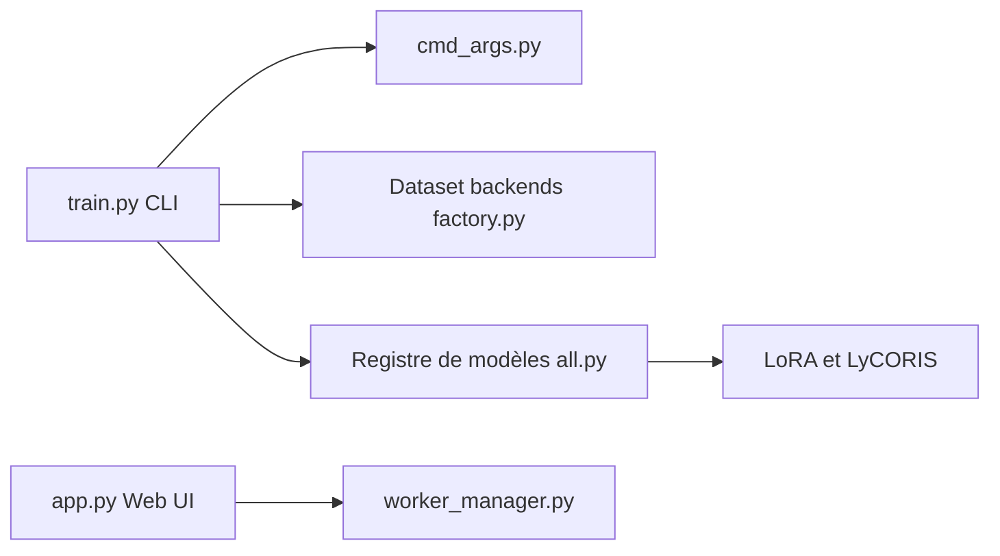

# bghira/SimpleTuner

> Boîte à outils pour entraîner ou affiner des modèles de diffusion image, vidéo et audio, en CLI ou interface web.

## Le problème
Affiner un modèle de diffusion (LoRA, pleine échelle) implique des pipelines dispersés par architecture, des problèmes de mémoire et peu de suivi d'équipe.

## Ce que ça fait vraiment
Un entraîneur unifié pour de nombreux modèles (Flux, SDXL, SD3, Wan, LTX Video, Qwen Image, ACE-Step…), avec cache d'embeddings, aspect bucketing, DeepSpeed et FSDP2, EMA, entraînement depuis S3. Une interface web et une plateforme multi-utilisateurs : orchestration de workers GPU, SSO, rôles, quotas, approbations et audit. Selon le README, aucune donnée n'est envoyée à des tiers hors options à activer (`report_to`, `push_to_hub`, webhooks).

## Comment c'est branché


## Essayer
```bash
pip install simpletuner
pip install 'simpletuner[cuda]'
pip install 'simpletuner[rocm]' --extra-index-url https://download.pytorch.org/whl/rocm7.1
pip install 'simpletuner[apple]'
```

## Coût et pièges
GPU requis : RTX 3080+ conseillé (NVIDIA), 24 Go pour la plupart des modèles en LoRA, A100 80 Go pour les plus gros en pleine échelle. Support AMD et Apple plus limité en mémoire.

## Ce que ce n'est pas
Pas un générateur d'images : il prépare des modèles. Licence AGPL-3.0, à examiner pour un usage en service. Les guides de démarrage par modèle sont des documents à part.

## Alternatives
Aucune alternative nommée dans le README.

## Pour toi
Adopter si tu affines des modèles génératifs : large couverture de modèles, options de mémoire et suivi d'équipe déjà intégrés, à condition d'accepter l'AGPL.

