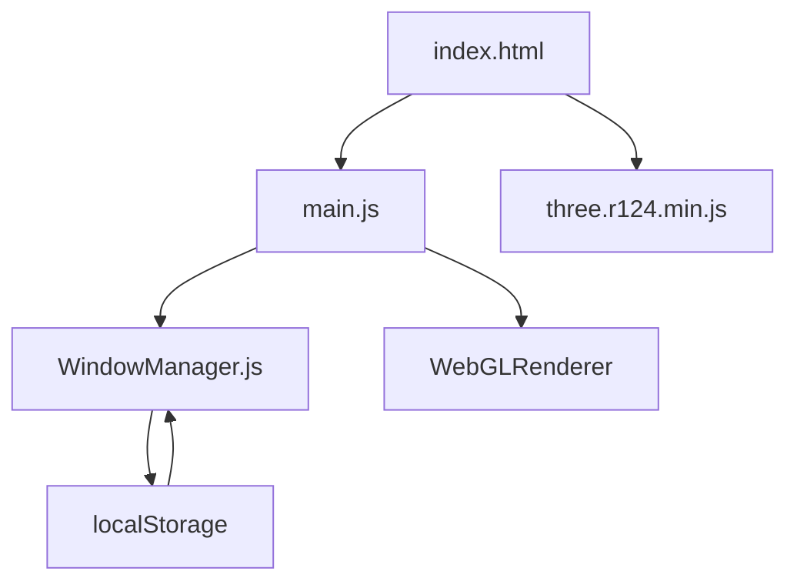

# bgstaal/multipleWindow3dScene

> Démo Three.js d'une scène 3D partagée entre plusieurs fenêtres de navigateur via localStorage.

## Le problème
Coordonner l'état de plusieurs fenêtres du même navigateur, sans serveur, est peu documenté.

## Ce que ça fait vraiment
Chaque fenêtre exécute la même page `index.html` avec Three.js r124. `WindowManager.js` enregistre l'état des fenêtres dans `localStorage` et réagit aux événements `storage` ; `main.js` initialise la scène et met à jour le rendu selon la position des fenêtres. Aucun backend.

## Comment c'est branché


## Essayer
```bash
git clone https://github.com/bgstaal/multipleWindow3dScene
```
Puis ouvrir `index.html` dans le navigateur.

## Coût et pièges
Gratuit. Le dernier push date de 2023 ; Three.js est figé en r124.

## Ce que ce n'est pas
Ce n'est pas une bibliothèque réutilisable ni un module publié : c'est une démonstration.

## Alternatives
Le README n'en cite aucune.

## Pour toi
À ignorer : démo graphique sans rapport avec data, IA ou MLOps ; intéressante seulement comme curiosité front-end.

