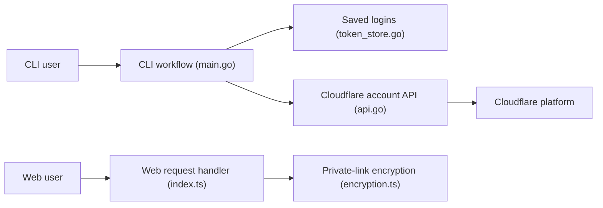

# bia-pain-bache/BPB-Wizard

> Assistant d'installation de « BPB Panel » sur un compte Cloudflare, en version web ou en ligne de commande.

## Le problème
Déployer BPB Panel à la main sur Cloudflare (Workers ou Pages, espace KV) est sujet aux erreurs de configuration.

## Ce que ça fait vraiment
Collecte les identifiants Cloudflare, choisit Workers ou Pages, crée un espace KV, génère le script du panneau, le déploie et renvoie l'URL. L'édition CLI (Go) mémorise plusieurs comptes ; l'édition web (TypeScript) produit un « lien privé » chiffré pour réinstaller en un clic. Ce que fait BPB Panel lui-même n'est pas décrit dans ce README.

## Comment c'est branché


## Essayer
```bash
bash <(curl -fsSL https://raw.githubusercontent.com/bia-pain-bache/BPB-Wizard/main/install.sh)
```
Windows : `irm https://raw.githubusercontent.com/bia-pain-bache/BPB-Wizard/main/install.ps1 | iex`.

## Coût et pièges
Gratuit côté outil, mais il exige un compte Cloudflare et son jeton, stocké sur ta machine (CLI). Installation par `curl | bash` ou `irm | iex`. Sous Android, Termux doit venir de GitHub.

## Ce que ce n'est pas
N'est pas l'application finale : il n'installe qu'un panneau externe dont le README ne dit rien. README très court, matière limitée.

## Alternatives
Aucune alternative nommée dans le README.

## Pour toi
À ignorer : dépend entièrement d'un panneau tiers non décrit et demande tes accès Cloudflare, sans rapport avec data/IA/MLOps.

