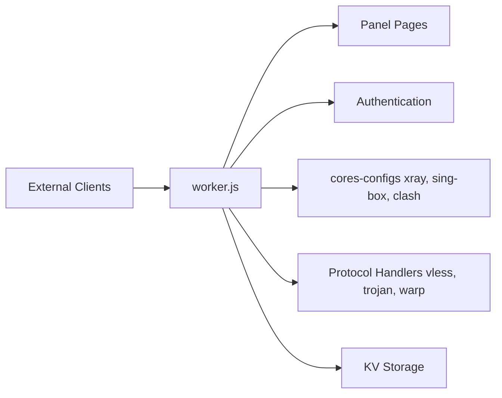

# bia-pain-bache/BPB-Worker-Panel

> Panneau web sur Cloudflare Workers pour générer des configurations proxy VLESS, Trojan et Warp.

## Le problème
Des utilisateurs dont les domaines ou services sont bloqués par leur FAI cherchent un proxy privé à déployer eux-mêmes.

## Ce que ça fait vraiment
Un script Worker (ou Pages) gère un panneau protégé par mot de passe et génère des abonnements pour les clients Xray, Sing-box et Clash-Mihomo. Prend en charge VLESS, Trojan, Warp, un DoH privé, la fragmentation, des règles de routage et des proxys en chaîne. La configuration est stockée dans Cloudflare KV.

## Comment c'est branché

## Essayer
Le README ne contient pas de commande : il renvoie aux pages d'installation (BPB Wizard) et à la FAQ.

## Coût et pièges
Gratuit mais dépend d'un compte Cloudflare. Limite de 100K requêtes par jour et par worker (VLESS/Trojan), pour 2 à 3 utilisateurs. UDP mal géré. Le README réclame des dons en USDT.

## Ce que ce n'est pas
Pas un VPN commercial : c'est un contournement de blocage réseau hébergé sur une plateforme tierce.

## Alternatives
Aucune alternative citée dans le README.

## Pour toi
À ignorer : outil de contournement réseau sans usage data/IA ; il dépend de Cloudflare et pourrait enfreindre ses conditions.

