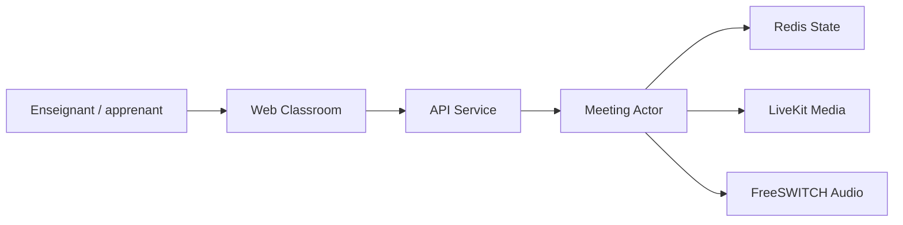

# bigbluebutton/bigbluebutton

> Salle de classe virtuelle open source : audio, vidéo, diapositives annotées, chat et partage d'écran pour l'enseignement à distance.

## Le problème
Enseigner à distance demande visio, tableau blanc, sondages, salles de sous-groupes et enregistrement, réunis dans un seul outil.

## Ce que ça fait vraiment
Partage en temps réel audio, vidéo, diapositives, chat et écran ; sondages, notes partagées, salles de sous-groupes, enregistrement, tableau de bord d'analyse. Selon l'architecture décrite : un service d'API et de sessions, des acteurs de réunion en Scala (utilisateurs, chat, voix), un état dans Redis, la conversion de présentations, LiveKit pour le média et FreeSWITCH pour l'audio, et un client web React.

## Comment c'est branché

## Essayer
Le README ne donne aucune commande : il évoque le script `bbb-install.sh` sur Ubuntu 22.04 et renvoie à la documentation officielle. Aucune commande reprise.

## Coût et pièges
Gratuit, mais à héberger sur un serveur Ubuntu 22.04 dédié avec de la bande passante. 725 issues ouvertes. Licence LGPL-3.0.

## Ce que ce n'est pas
Ce n'est pas un simple outil de visio léger : c'est une plateforme à déployer et à exploiter. Le nom BigBlueButton est une marque déposée.

## Alternatives
Aucune alternative nommée dans le README.

## Pour toi
À ignorer : plateforme d'enseignement à exploiter, sans rapport avec un flux data/IA, sauf besoin précis de classe virtuelle auto-hébergée.

