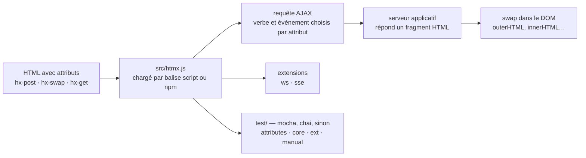

# bigskysoftware/htmx

> **HTML attributes that fire AJAX requests and swap part of the page, with no JavaScript written.**

## The problem

In plain HTML, only `<a>` and `<form>` can issue an HTTP request, only `click` and `submit`
trigger one, only GET and POST are available, and the response replaces the whole screen. As
soon as you want to update a fragment of the page on some other event, or with another verb,
you have to move to JavaScript and client-side rendering — a full toolchain where four missing
boxes were the actual gap.

## What it actually does

htmx removes those four constraints by exposing them as HTML attributes. The README gives the
canonical example: `hx-post="/clicked"` on a `<button>` issues an AJAX request on click, and
`hx-swap="outerHTML"` says the response replaces the entire button. The server therefore
returns **HTML**, not JSON — that shift of responsibility is the heart of it.

Beyond AJAX, the README advertises access from HTML to CSS transitions, WebSockets and Server
Sent Events, the latter two through extensions. The extension mechanism is presented as a
documented entry point of its own.

The library is stated to be dependency-free, around 14k minified and gzipped, and loads through
a single `<script>` tag from a CDN with an `integrity` attribute. htmx is presented as the
successor to intercooler.js. Reference documentation (attributes, examples) lives outside the
repository, on htmx.org.

## How it is wired



No code-derived diagram exists for this repository: this one is reconstructed from the README
alone. The file names come from the contribution guide it contains: all modifiable code sits in
`/src/htmx.js`, and tests are split across `/test/index.html` (the root page that includes the
others), `/test/attributes`, `/test/core` — including `/test/core/regressions.js` —,
`/test/ext` and `/test/manual` for what cannot be automated.

## Try it

```html
  <script src="https://cdn.jsdelivr.net/npm/htmx.org@2.0.10/dist/htmx.min.js"    
          integrity="sha384-H5SrcfygHmAuTDZphMHqBJLc3FhssKjG7w/CeCpFReSfwBWDTKpkzPP8c+cLsK+V" 
          crossorigin="anonymous"></script>
  <!-- have a button POST a click via AJAX -->
  <button hx-post="/clicked" hx-swap="outerHTML">
    Click Me
  </button>
```

As a Node package, the README gives:

```
npm install htmx.org --save
```

To work on htmx itself (development dependencies, local web server, test suite reachable at
`http://0.0.0.0:3000/test/`):

```
npm install
npx serve
```

## Cost and traps

- **Licence**: the catalogue records `NOASSERTION`, meaning GitHub did not identify the licence
  file, and the README says nothing about it. To be settled against the repository before any
  internal use — that is the reason for the alert.
- **The packaging trap is flagged by the README itself**: the npm package to install is
  `htmx.org`, not `htmx`, the latter being an old broken package.
- **The documentation is not in the repository**: attributes, examples and extensions all point
  to htmx.org. The README alone is not enough to write a page, and the site is a third-party
  hosted service (Netlify badge) you depend on in order to learn.
- **The real cost sits on the server side**: htmx assumes an application able to answer with
  HTML fragments. If the existing backend only speaks JSON, that backend is what must change,
  and that work is not part of htmx.
- **CDN loading** makes pages depend on jsdelivr at runtime; the `integrity` attribute protects
  integrity, not availability.
- Otherwise installation costs nothing: no key, no account, no declared dependency.

## What it is not

- **It is not a component framework**: no component model, no client-side state, no virtual
  rendering. htmx wires events to requests and swaps chunks of DOM; everything else belongs to
  the server.
- **It is not a JSON API client.** What it expects back is HTML. Pointing htmx at a REST API
  that returns objects requires an intermediate rendering layer, which is not provided.
- **It is not an off-the-shelf real-time solution**: WebSockets and Server Sent Events go
  through separate extensions, outside the core.
- **It is not a replacement for JavaScript** in purely local interactions (computations, driven
  animations, interface state): by construction, every interaction makes a server round trip.

## Alternatives

The README names a single related repository: **intercooler.js**, which htmx is announced as the
successor to — worth choosing only to maintain existing code that already depends on it.

The neighbours proposed by the catalogue (`open-policy-agent/opa`, `dillonzq/LoveIt`,
`PostHog/posthog`, `pulumi/pulumi`) are not comparable: a policy engine, a static-site theme,
product analytics and an infrastructure tool, none of which deal with the interactivity of an
HTML page.

## For you

Worth adopting for everything that surrounds data work without deserving a full front-end:
internal dashboard, training-monitoring page, a form that relaunches a job. One `<script>` tag,
a few attributes, and a Python or Node backend that already renders templates are enough — no
build chain, no extra node in the project. Skip it if the interface must stay responsive
offline or juggle a lot of state in the browser.
