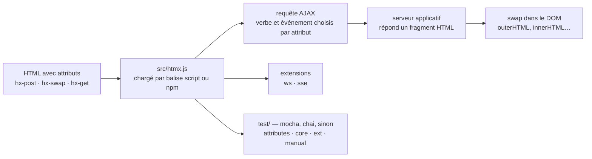

# bigskysoftware/htmx

> **Des attributs HTML qui déclenchent des requêtes AJAX et remplacent un morceau de page, sans écrire de JavaScript.**

## Le problème

En HTML seul, seuls `<a>` et `<form>` peuvent émettre une requête HTTP, seuls les événements
`click` et `submit` la déclenchent, seuls GET et POST sont disponibles, et la réponse remplace
l'écran entier. Dès qu'on veut mettre à jour un fragment de page sur un autre événement ou avec
un autre verbe, il faut basculer sur du JavaScript et un rendu côté client — c'est-à-dire un
outillage complet là où il ne manquait que quatre cases au formulaire de départ.

## Ce que ça fait vraiment

htmx lève ces quatre contraintes en les exposant comme attributs HTML. Le README donne
l'exemple canonique : `hx-post="/clicked"` sur un `<button>` envoie une requête AJAX au clic,
et `hx-swap="outerHTML"` indique que la réponse remplace le bouton entier. Le serveur renvoie
donc du **HTML**, pas du JSON — c'est le déplacement de responsabilité central.

Au-delà d'AJAX, le README annonce l'accès depuis HTML aux transitions CSS, aux WebSockets et
aux Server Sent Events, ces deux derniers via des extensions. Le mécanisme d'extension est
annoncé comme un point d'entrée documenté à part.

La bibliothèque est annoncée sans dépendances, autour de 14 ko une fois minifiée et
compressée, et se charge par une balise `<script>` unique depuis un CDN avec attribut
`integrity`. htmx est présenté comme le successeur d'intercooler.js. La documentation de
référence (attributs, exemples) est hors dépôt, sur htmx.org.

## Comment c'est branché



Aucun diagramme tiré du code n'existe pour ce dépôt : ce schéma est reconstruit depuis le seul
README. Les noms de fichiers viennent du guide de contribution qu'il contient : tout le code
modifiable tient dans `/src/htmx.js`, et les tests se répartissent entre `/test/index.html`
(page racine qui inclut les autres), `/test/attributes`, `/test/core` — dont
`/test/core/regressions.js` —, `/test/ext` et `/test/manual` pour ce qui n'est pas
automatisable.

## Essayer

```html
  <script src="https://cdn.jsdelivr.net/npm/htmx.org@2.0.10/dist/htmx.min.js"    
          integrity="sha384-H5SrcfygHmAuTDZphMHqBJLc3FhssKjG7w/CeCpFReSfwBWDTKpkzPP8c+cLsK+V" 
          crossorigin="anonymous"></script>
  <!-- have a button POST a click via AJAX -->
  <button hx-post="/clicked" hx-swap="outerHTML">
    Click Me
  </button>
```

En paquet Node, le README donne :

```
npm install htmx.org --save
```

Pour travailler sur htmx lui-même (dépendances de développement, serveur local, suite de
tests à ouvrir sur `http://0.0.0.0:3000/test/`) :

```
npm install
npx serve
```

## Coût et pièges

- **Licence** : le catalogue relève `NOASSERTION`, c'est-à-dire que GitHub n'a pas identifié le
  fichier de licence, et le README n'en dit pas un mot. À lever sur le dépôt avant tout usage
  interne — c'est la raison de l'alerte.
- **Le piège de paquet est signalé par le README lui-même** : le paquet npm à installer est
  `htmx.org`, pas `htmx`, ce dernier étant un ancien paquet cassé.
- **La documentation n'est pas dans le dépôt** : attributs, exemples et extensions renvoient
  tous vers htmx.org. Le README seul ne suffit pas à écrire une page, et le site est un
  service hébergé tiers (badge Netlify) dont on dépend pour apprendre.
- **Le vrai coût est côté serveur** : htmx suppose une application qui sait répondre des
  fragments HTML. Si le backend existant ne parle que JSON, c'est lui qu'il faut modifier, et
  ce travail n'est pas dans htmx.
- **Le chargement par CDN** fait dépendre les pages de jsdelivr à l'exécution ; l'attribut
  `integrity` protège l'intégrité, pas la disponibilité.
- Installation nulle par ailleurs : pas de clé, pas de compte, pas de dépendance annoncée.

## Ce que ce n'est pas

- **Ce n'est pas un framework de composants** : pas de modèle de composant, pas d'état côté
  client, pas de rendu virtuel. htmx câble des événements à des requêtes et remplace des
  morceaux de DOM ; tout le reste appartient au serveur.
- **Ce n'est pas un client d'API JSON.** Ce qu'il attend en réponse est du HTML. Brancher htmx
  sur une API REST qui renvoie des objets demande une couche de rendu intermédiaire, non
  fournie.
- **Ce n'est pas une solution de temps réel prête à l'emploi** : WebSockets et Server Sent
  Events passent par des extensions distinctes, hors du cœur.
- **Ce n'est pas un substitut à JavaScript** pour les interactions purement locales (calculs,
  animations pilotées, état d'interface) : par construction, chaque interaction passe par un
  aller-retour serveur.

## Alternatives

Le README ne cite qu'un dépôt apparenté : **intercooler.js**, dont htmx est annoncé comme le
successeur — à ne choisir que pour maintenir un code existant qui en dépend déjà.

Les voisins proposés par le catalogue (`open-policy-agent/opa`, `dillonzq/LoveIt`,
`PostHog/posthog`, `pulumi/pulumi`) ne sont pas comparables : moteur de politiques, thème de
site statique, analytique produit et outil d'infrastructure, aucun ne traite l'interactivité
d'une page HTML.

## Pour toi

À adopter pour tout ce qui entoure un travail de données sans le mériter d'un front-end
complet : tableau de bord interne, page de suivi d'entraînement, formulaire de relance d'un
traitement. Une balise `<script>`, quelques attributs, et un backend Python ou Node qui rend
déjà des gabarits suffisent — pas de chaîne de build, pas de nœud dans le projet. À écarter
si l'interface doit rester réactive hors ligne ou manipuler beaucoup d'état côté navigateur.
