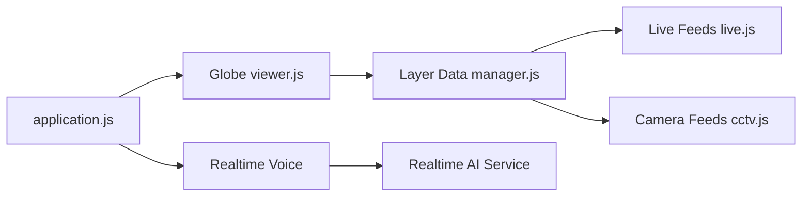

# bilawalsidhu/gods-eye-view

> Globe 3D dans le navigateur qui superpose avions, navires, satellites, caméras publiques, avec commande vocale optionnelle.

## Le problème
Les signaux publics (vols, AIS, orbites, séismes, caméras) sont éparpillés ; les croiser sur une carte explorable demande beaucoup d'assemblage.

## Ce que ça fait vraiment
Client CesiumJS en JavaScript sans framework, servi par Vite, avec un module par couche de données. Quinze couches, dont treize sans clé. La voix passe par l'API Realtime d'OpenAI (28 outils), via un proxy côté serveur qui garde les clés. Trafic simulé, poses de caméras et trajectoires de fusées sont des estimations.

## Comment c'est branché


## Essayer
```bash
git clone https://github.com/bilawalsidhu/gods-eye-view.git
cd gods-eye-view
npm ci
npm run doctor
npm run dev
```
Puis ouvrir `http://localhost:4173`.

## Coût et pièges
Démarre sans clé. La voix exige une clé OpenAI, payante (plafond de 5 $ par session dans l'app). Google 3D direct est facturé ; Cesium ion est gratuit pour usage personnel non commercial. Node 24.14 ou 26.

## Ce que ce n'est pas
Pas un outil opérationnel : le README interdit navigation, urgences et décisions critiques, car les données peuvent être en retard ou fausses. Licence non identifiée par GitHub (le README cite MIT).

## Alternatives
Aucune alternative nommée dans le README.

## Pour toi
À surveiller : bon exemple de fusion de flux temps réel et d'agent vocal, mais 201 issues ouvertes, dépôt né en juin 2026 et licence à confirmer avant réutilisation.

